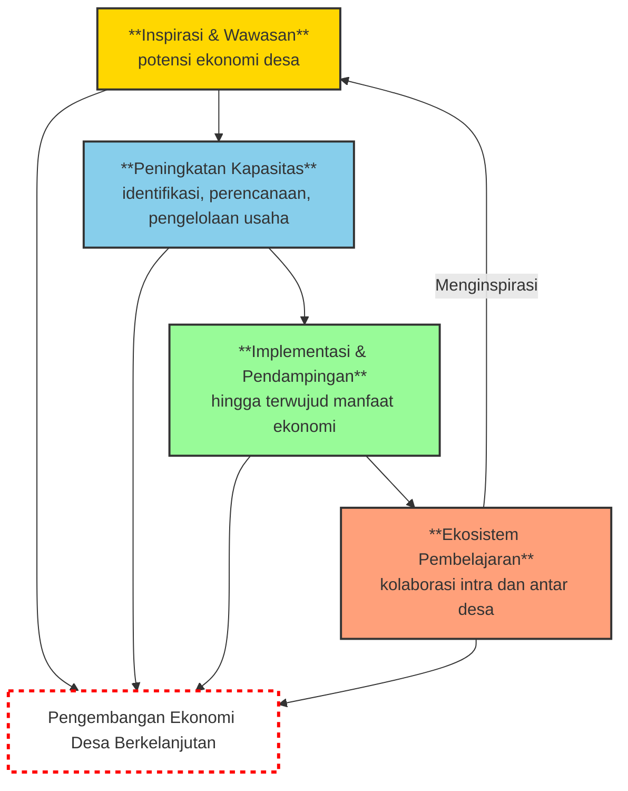
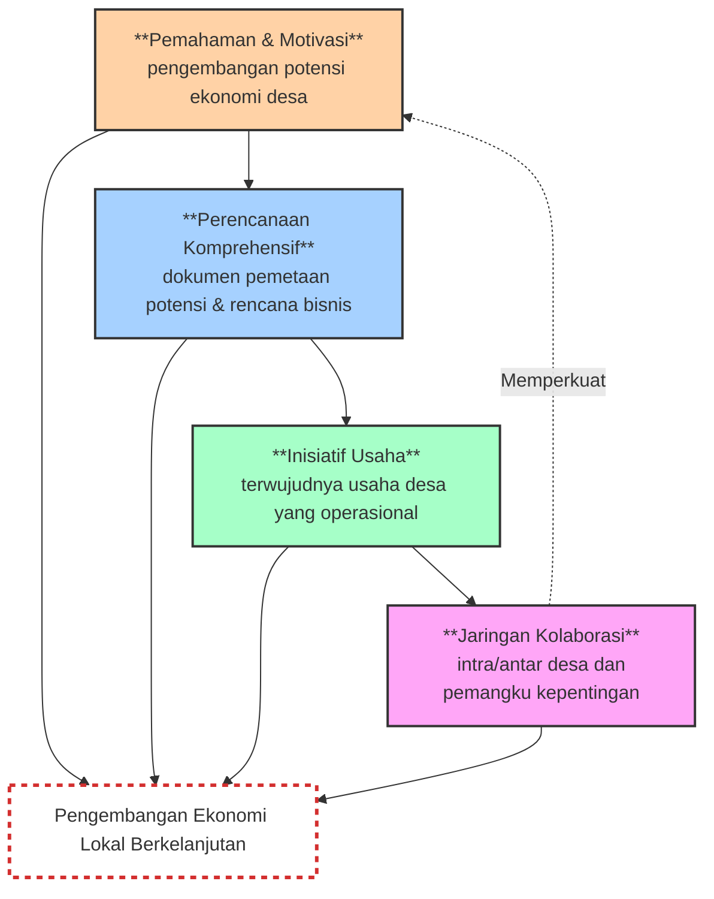
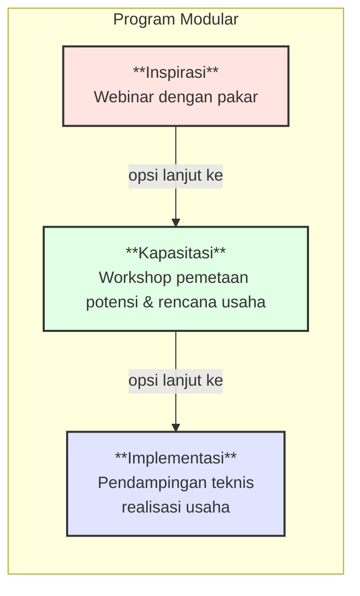
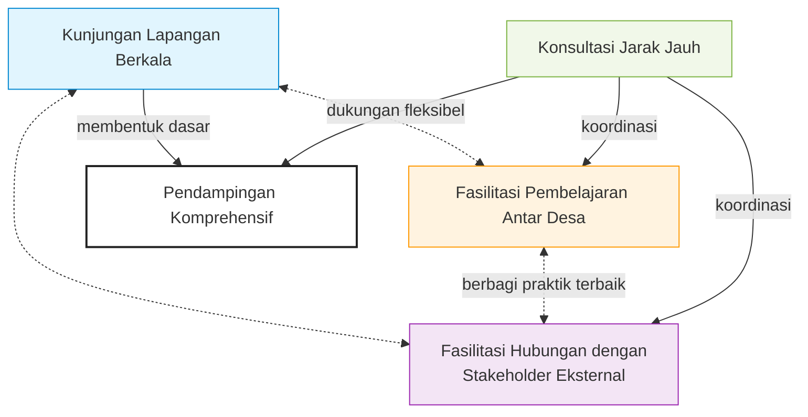

# Akselerator Bisnis Komunitas Desa

Cakra Consulting, 2025

## A. Kerangka Acuan Kerja

### 1. INFORMASI UMUM

#### 1.1. Nama Program

Program Pemberdayaan dan Pengembangan Potensi Ekonomi Desa "Akselerator Bisnis Komunitas Desa"

#### 1.2. Penyelenggara

Cakra Consulting - Lembaga Konsultasi dan Pendampingan Profesional

#### 1.3. Latar Belakang

Indonesia memiliki lebih dari 74.000 desa dengan beragam potensi ekonomi yang belum teroptimalkan. Berbagai tantangan seperti keterbatasan pengetahuan, akses pasar, modal, dan teknologi sering menjadi hambatan bagi desa untuk mengembangkan potensi ekonominya.

Cakra Consulting sebagai lembaga konsultasi dan pendampingan profesional memahami bahwa pengembangan ekonomi desa memerlukan pendekatan bertahap, sistematis, dan berkelanjutan yang disesuaikan dengan kebutuhan dan kondisi masing-masing desa.

Berdasarkan pengalaman Cakra Consulting dalam mendampingi pengembangan ekonomi berbasis komunitas, terdapat tiga aspek krusial yang perlu difasilitasi: *pertama,* inspirasi dan motivasi dari contoh keberhasilan; *kedua,* kapasitas perencanaan dan pengelolaan usaha; *ketiga,* pendampingan teknis dalam implementasi.

Program ini dirancang untuk memfasilitasi ketiga aspek tersebut secara bertahap dan modular, memungkinkan desa untuk bergabung sesuai kebutuhan dan kemampuan finansial mereka.

#### 1.4. Tujuan Program

1. Memberikan inspirasi dan wawasan kepada aparatur desa dan masyarakat mengenai potensi pengembangan ekonomi desa melalui paparan kisah sukses dari berbagai bidang usaha.

2. Meningkatkan kapasitas aparatur desa dan masyarakat dalam mengidentifikasi, merencanakan, dan mengelola usaha berbasis potensi desa.

3. Mendampingi desa dalam implementasi rencana pengembangan usaha hingga terwujudnya manfaat ekonomi yang nyata dan berkelanjutan.

4. Menciptakan ekosistem pembelajaran dan kolaborasi antar desa dalam pengembangan ekonomi lokal.

#### 1.5. Keluaran yang Diharapkan

1. Meningkatnya pemahaman dan motivasi aparatur desa dan masyarakat dalam mengembangkan potensi ekonomi desa.

2. Tersusunnya dokumen pemetaan potensi dan rencana pengembangan usaha desa yang komprehensif dan implementatif.

3. Terwujudnya minimal satu inisiatif usaha berbasis potensi desa yang operasional dan memberikan manfaat ekonomi.

4. Terbangunnya jaringan kerja sama antar desa dan dengan berbagai pemangku kepentingan dalam pengembangan ekonomi lokal.

### 2. DESAIN PROGRAM

#### 2.1. Pendekatan Program

Program ini dirancang dengan pendekatan modular. Terdiri dari tiga tahapan utama yang dapat diikuti secara terpisah atau berurutan, sesuai dengan kebutuhan dan kesiapan masing-masing desa, yakni:

1. **Tahap Inspirasi**

   Webinar dengan pembicara dari tiga bidang berbeda yang telah berhasil mengembangkan potensi desa.

2. **Tahap Kapasitasi**

   Workshop pemetaan potensi dan perencanaan usaha desa.

3. **Tahap Implementasi**

   Pendampingan teknis dalam realisasi usaha berbasis potensi desa.

Setiap desa dapat memilih untuk mengikuti hanya satu, dua, atau sekaligus ketiga tahapan program sesuai dengan kebutuhan dan kemampuan pembiayaan.

Pendekatan ini memungkinkan desa untuk memulai dari titik yang paling sesuai dengan kondisi mereka dan melanjutkan ke tahapan berikutnya ketika mereka siap.

#### 2.2. Struktur Program

##### 2.2.1. Tahap Inspirasi: Webinar "Mengungkap Potensi Desa"

###### 2.2.1.1. Durasi

1 hari (6 jam)

###### 2.2.1.2. Tema

"Transformasi Ekonomi Desa: Inspirasi dari Tiga Sektor Unggulan"

###### 2.2.1.3. Pembicara

1. Praktisi sukses pengembangan desa wisata.

2. Praktisi sukses pengembangan agribisnis/peternakan desa.

3. Praktisi sukses pengembangan industri kreatif/UMKM berbasis desa.

###### 2.2.1.4. Agenda

| No. | Kegiatan                                      | Durasi    |
|-----|-----------------------------------------------|-----------|
| 1   | Pembukaan dan pengantar program              | 30 menit  |
| 2   | Presentasi pembicara 1: Pengembangan Desa Wisata | 60 menit  |
| 3   | Presentasi pembicara 2: Pengembangan Agribisnis/Peternakan Desa | 60 menit  |
| 4   | Istirahat                                     | 30 menit  |
| 5   | Presentasi pembicara 3: Pengembangan Industri Kreatif/UMKM Desa | 60 menit  |
| 6   | Panel diskusi dengan ketiga pembicara        | 90 menit  |
| 7   | Networking dan penutupan                     | 30 menit  |

###### 2.2.1.5. Output

1. Peningkatan pemahaman dan motivasi peserta

2. Identifikasi awal minat dan potensi desa

##### 2.2.2. Tahap Kapasitasi: Workshop "Merencanakan Usaha Desa"

###### 2.2.2.1. Durasi

3 hari (24 jam)

###### 2.2.2.2. Materi

| Hari       | Materi Utama                              | Topik Bahasan                                                                                                                                 |
|------------|-------------------------------------------|-------------------------------------------------------------------------------------------------------------------------------------------------|
| 1 | Pemetaan & Analisis Potensi Desa        | 1. Teknik pemetaan aset & potensi desa (sumber daya alam, manusia, sosial, finansial, infrastruktur) 2. Analisis *SWOT* & prioritas pengembangan 3. Studi kasus sukses sesuai sektor yang diminati |
| | | |
| 2   | Perencanaan Model & Strategi Bisnis     | 1. Pengembangan model bisnis dengan *Business Model Canvas* 2. Penentuan proposisi nilai & keunggulan kompetitif 3. Strategi operasional & pengelolaan sumber daya 4. Struktur organisasi & tata kelola usaha desa |
| | | |
| 3  | Perencanaan Finansial & Implementasi    | 1. Penyusunan rencana keuangan & proyeksi bisnis 2. Strategi penggalangan modal & manajemen keuangan 3. Rencana pemasaran & pengembangan pasar 4. Penyusunan rencana aksi implementasi |

###### 2.2.2.3. Output

1. Dokumen pemetaan potensi desa

2. *Business model canvas* usaha desa

3. Rencana bisnis tertulis

4. Proyeksi keuangan 3 tahun

5. Rencana implementasi bertahap

##### 2.2.3. Tahap Implementasi: Pendampingan "Mewujudkan Usaha Desa"

###### 2.2.3.1. Durasi

6 bulan (kunjungan berkala dan konsultasi jarak jauh)

###### 2.2.3.2. Komponen Pendampingan

| Aspek                        | Komponen Pendampingan                                                                 |
|------------------------------|---------------------------------------------------------------------------------------|
| **Legal & Kelembagaan** | a. Fasilitasi pembentukan atau penguatan kelembagaan (BUMDes/Koperasi) b. Pendampingan perizinan dan legalitas usaha c. Penyusunan standar operasional prosedur dan tata kelola |
| | | |
| **Teknis & Operasional** | a. Pendampingan pengembangan produk/jasa b. Penerapan teknologi dan inovasi yang relevan c. Sistem manajemen kualitas dan standarisasi |
| | | |
| **Finansial**        | a. Fasilitasi akses ke sumber permodalan (bank, hibah, CSR) b. Penyusunan laporan keuangan dan akuntansi sederhana c. Manajemen arus kas dan investasi |
| | | |
| **Pemasaran**        | a. Pengembangan brand dan strategi komunikasi b. Pemasaran digital dan konvensional c. Pengembangan jaringan distribusi dan mitra bisnis |

###### 2.2.3.3. Mekanisme Pendampingan

1. Kunjungan lapangan berkala (minimal 1x sebulan)

2. Konsultasi jarak jauh (telepon/video call/email) sesuai kebutuhan

3. Fasilitasi pembelajaran antar desa (peer learning)

4. Fasilitasi hubungan dengan stakeholder eksternal

###### 2.2.3.4. Output

1. Usaha berbasis potensi desa yang operasional

2. Sistem pengelolaan usaha yang berkelanjutan

3. Peningkatan kapasitas SDM lokal

4. Peningkatan pendapatan desa dan masyarakat

### 3. PESERTA DAN PARTISIPASI

#### 3.1. Kriteria Peserta

| Tahap                                | Kriteria Peserta                                                                                                                                 |
|--------------------------------------|-------------------------------------------------------------------------------------------------------------------------------------------------|
| **1. Inspirasi (Webinar)**     | 1. Kepala Desa dan perangkat desa 2. Pengurus BUMDes/lembaga ekonomi desa 3. Tokoh masyarakat dan pelaku usaha desa 4. Perwakilan kelompok masyarakat produktif 5. Tidak ada batasan jumlah peserta per desa |
|                                      |                                                                                                                                                 |
| **2. Kapasitasi (Workshop)**   | 1. Desa yang telah mengikuti webinar dan menunjukkan komitmen untuk pengembangan ekonomi desa 2. Tim desa yang terdiri dari 5-7 orang (Kepala Desa/perangkat desa, pengurus BUMDes, tokoh masyarakat/pelaku usaha) 3. Memiliki identifikasi awal potensi desa yang akan dikembangkan 4. Bersedia menyediakan pendanaan untuk mengikuti workshop |
|                                      |                                                                                                                                                 |
| **3. Implementasi (Pendampingan)** | 1. Desa yang telah menyelesaikan workshop dan memiliki dokumen perencanaan usaha 2. Memiliki komitmen tertulis dari pemerintah desa untuk implementasi 3. Memiliki alokasi anggaran desa untuk pengembangan usaha 4. Bersedia menyediakan pendanaan untuk program pendampingan |

#### 3.2. Mekanisme Seleksi

Mekanisme seleksi desa peserta program dilakukan secara bertahap.

| Tahap Seleksi                       | Mekanisme Seleksi                                                                                                                               |
|-------------------------------------|-------------------------------------------------------------------------------------------------------------------------------------------------|
| **1. Dari Webinar ke Workshop**     | 1. Pengisian formulir minat dan komitmen setelah webinar 2. Wawancara singkat dengan tim Cakra Consulting 3. Seleksi berdasarkan kesiapan dan potensi keberhasilan |
|                                     |                                                                                                                                                 |
| **2. Dari Workshop ke Pendampingan** | 1. Evaluasi kualitas dokumen perencanaan yang dihasilkan dari workshop 2. Presentasi rencana implementasi di hadapan tim Cakra Consulting 3. Verifikasi dukungan dan komitmen pemerintah desa 4. Seleksi berdasarkan kelayakan usaha dan kapasitas implementasi |

#### 3.3. Biaya Partisipasi

Program ini menerapkan pembagian biaya (*cost-sharing*) dengan skema sebagai berikut:

| Tahap                                | Biaya Partisipasi                            | Opsi Pembiayaan                                                                 |
|--------------------------------------|----------------------------------------------|---------------------------------------------------------------------------------|
| **1. Inspirasi (Webinar)**     | a. [sesuai ketentuan]                        | b. Dana desa, APBDes, atau sumber lain                                         |
|                                      |                                              |                                                                                 |
| **2. Kapasitasi (Workshop)**   | a. [sesuai ketentuan] per tim desa           | b. Dana desa, APBDes, program CSR, atau sumber lain                            |
|                                      |                                              |                                                                                 |
| **3. Implementasi (Pendampingan)** | a. [sesuai ketentuan] per desa selama 6 bulan | b. Dana desa, APBDes, program CSR, bantuan pemerintah, atau kombinasi berbagai sumber |

#### 3.4. Fasilitas yang Diberikan

| Tahap                                | Fasilitas                                                                                                                               |
|--------------------------------------|-----------------------------------------------------------------------------------------------------------------------------------------|
| **1. Inspirasi (Webinar)**     | a. Akses ke webinar interaktif dengan tiga pembicara ahli b. Materi presentasi dalam bentuk digital c. Rekaman video webinar d. Sertifikat keikutsertaan digital |
|                                      |                                                                                                                                         |
| **2. Kapasitasi (Workshop)**   | a. Modul pelatihan lengkap b. Alat bantu pemetaan dan perencanaan c. Template dokumen perencanaan d. Konsumsi selama workshop e. Sertifikat keikutsertaan f. Fasilitasi oleh tim ahli Cakra Consulting |
|                                      |                                                                                                                                         |
| **3. Implementasi (Pendampingan)** | a. Kunjungan pendampingan berkala b. Konsultasi jarak jauh tanpa batas c. Akses ke jaringan ahli Cakra Consulting d. Template dokumen operasional e. Fasilitasi akses ke program pendukung f. Laporan perkembangan berkala g. Dokumentasi proses dan hasil |

### 4. METODE PELAKSANAAN

#### 4.1. Tahap Persiapan

| Kegiatan                                | Detail Kegiatan                                                                                                                               |
|-----------------------------------------|-----------------------------------------------------------------------------------------------------------------------------------------------|
| **1. Penyiapan Materi dan Sumber Daya** | a. Pengembangan modul dan materi pelatihan b. Penyusunan pedoman dan instrumen pendampingan c. Rekrutmen dan briefing tim pelaksana |
|                                         |                                                                                                                                               |
| **2. Sosialisasi Program**              | a. Penyebaran informasi melalui kanal online dan offline b. Koordinasi dengan pemerintah kabupaten/kecamatan c. Webinar perkenalan program (opsional) |
|                                         |                                                                                                                                               |
| **3. Pendaftaran Desa Peserta**         | a. Penerimaan dan verifikasi formulir pendaftaran b. Konfirmasi keikutsertaan                                                           |

#### 4.2. Pelaksanaan Webinar

| Tahap                                | Detail Kegiatan                                                                                                                               |
|--------------------------------------|-----------------------------------------------------------------------------------------------------------------------------------------------|
| **1. Persiapan Teknis**              | a. Setup platform webinar dan pengujian teknis b. Briefing pembicara dan moderator c. Distribusi panduan teknis kepada peserta          |
|                                      |                                                                                                                                               |
| **2. Pelaksanaan Webinar**           | a. Registrasi peserta online b. Sesi presentasi tiga pembicara c. Sesi tanya jawab dan diskusi panel d. Pengisian formulir minat lanjutan |
|                                      |                                                                                                                                               |
| **3. Tindak Lanjut Webinar**         | a. Distribusi rekaman dan materi b. Pengumpulan dan analisis umpan balik c. Seleksi desa untuk workshop (lihat Bagian 3.3.2)             |

#### 4.3. Pelaksanaan Workshop

| Hari/Kegiatan                        | Detail Kegiatan                                                                                                                               |
|--------------------------------------|-----------------------------------------------------------------------------------------------------------------------------------------------|
| **1. Persiapan Logistik**            | a. Pemilihan dan persiapan lokasi b. Penyiapan alat bantu dan perlengkapan c. Konfirmasi kehadiran tim desa                     |
|                                      |                                                                                                                                               |
| **2. Hari Pertama**                  | a. Pembukaan dan pengantar program b. Sesi pemetaan potensi desa c. Analisis SWOT dan prioritas pengembangan d. Evaluasi harian dan penugasan |
|                                      |                                                                                                                                               |
| **3. Hari Kedua**                    | a. Review penugasan b. Pengembangan model bisnis c. Perencanaan operasional dan tata kelola d. Evaluasi harian dan penugasan |
|                                      |                                                                                                                                               |
| **4. Hari Ketiga**                   | a. Review penugasan b. Perencanaan finansial c. Finalisasi rencana implementasi d. Presentasi rencana oleh tim desa e. Evaluasi dan rencana tindak lanjut |

#### 4.4. Pelaksanaan Pendampingan

| Fase Pendampingan                     | Detail Kegiatan                                                                                                                               |
|---------------------------------------|-----------------------------------------------------------------------------------------------------------------------------------------------|
| **1. Persiapan Pendampingan**         | a. Penandatanganan kesepakatan pendampingan b. Penyusunan jadwal kunjungan c. Pembentukan grup komunikasi online                |
|                                       |                                                                                                                                               |
| **2. Bulan 1-2: Fokus Legalitas & Kelembagaan** | a. Sosialisasi rencana usaha kepada masyarakat b. Penguatan kelembagaan (BUMDes/Koperasi) c. Penyiapan legalitas dan perizinan awal d. Finalisasi rencana operasional |
|                                       |                                                                                                                                               |
| **3. Bulan 3-4: Fokus Teknis & Operasional** | a. Implementasi rencana operasional b. Pengembangan produk/jasa c. Penguatan kapasitas SDM pelaksana d. Pengembangan sistem pengelolaan |
|                                       |                                                                                                                                               |
| **4. Bulan 5-6: Fokus Finansial & Pemasaran** | a. Pengembangan strategi pemasaran b. Fasilitasi akses permodalan c. Evaluasi dan penyesuaian implementasi d. Penguatan jaringan mitra e. Penyusunan rencana keberlanjutan |

#### 4.5. Monitoring dan Evaluasi

| Jenis Kegiatan                        | Detail Kegiatan                                                                                                                               |
|---------------------------------------|-----------------------------------------------------------------------------------------------------------------------------------------------|
| **1. Monitoring Proses**              | a. Dokumentasi kegiatan b. Laporan perkembangan berkala c. Evaluasi pencapaian milestone                                        |
|                                       |                                                                                                                                               |
| **2. Evaluasi Hasil**                 | a. Pengukuran indikator keberhasilan (lihat Bagian 7) b. Dokumentasi perubahan dan dampak c. Identifikasi pembelajaran dan praktik baik |
|                                       |                                                                                                                                               |
| **3. Diseminasi Hasil**               | a. Penyusunan laporan akhir b. Dokumentasi video/foto c. Publikasi cerita sukses (jika ada)                                     |

### 5. JADWAL PELAKSANAAN

#### 5.1. Jadwal Indikatif

| No | Kegiatan | Bulan 1 | Bulan 2 | Bulan 3 | Bulan 4 | Bulan 5 | Bulan 6 | Bulan 7 | Bulan 8 | Bulan 9 |
|---|----------|---------|---------|---------|---------|---------|---------|---------|---------|---------|
| 1 | Persiapan | ✓ | | | | | | | | |
| 2 | Webinar | | ✓ | | | | | | | |
| 3 | Seleksi untuk Workshop | | ✓ | | | | | | | |
| 4 | Workshop | | | ✓ | | | | | | |
| 5 | Seleksi untuk Pendampingan | | | ✓ | | | | | | |
| 6 | Pendampingan | | | | ✓ | ✓ | ✓ | ✓ | ✓ | ✓ |
| 7 | Evaluasi dan Pelaporan | | | | | | | | | ✓ |

#### 5.2. Timeline Detail Webinar

| No | Kegiatan                           | Timeline                          |
|----|------------------------------------|-----------------------------------|
| 1  | Sosialisasi dan pendaftaran        | 2 pekan sebelum pelaksanaan      |
|    |                                    |                                   |
| 2  | Konfirmasi peserta                 | 1 pekan sebelum pelaksanaan      |
|    |                                    |                                   |
| 3  | Pelaksanaan webinar                | 1 hari                            |
|    |                                    |                                   |
| 4  | Pendaftaran untuk workshop         | Maksimal 1 pekan setelah webinar |

#### 5.3. Timeline Detail Workshop

| No | Kegiatan                               | Timeline                          |
|----|----------------------------------------|-----------------------------------|
| 1  | Seleksi peserta workshop               | 1 pekan setelah webinar          |
|    |                                        |                                   |
| 2  | Konfirmasi keikutsertaan dan pembayaran | 1 pekan sebelum workshop         |
|    |                                        |                                   |
| 3  | Pelaksanaan workshop                   | 3 hari berturut-turut             |
|    |                                        |                                   |
| 4  | Pendaftaran untuk pendampingan         | Maksimal 1 pekan setelah workshop |

#### 5.4. Timeline Detail Pendampingan

| No | Kegiatan                              | Timeline                          |
|----|---------------------------------------|-----------------------------------|
| 1  | Seleksi desa untuk pendampingan       | 1 pekan setelah workshop         |
|    |                                       |                                   |
| 2  | Penandatanganan kesepakatan           | Sebelum memulai pendampingan      |
|    |                                       |                                   |
| 3  | Kunjungan pendampingan                | Minimal 1x per bulan selama 6 bulan |
|    |                                       |                                   |
| 4  | Evaluasi tengah                       | Setelah 3 bulan pendampingan      |
|    |                                       |                                   |
| 5  | Evaluasi akhir                        | Setelah 6 bulan pendampingan      |

### 6. TIM PELAKSANA

#### 6.1. Struktur Tim

Program ini akan dilaksanakan oleh tim inti yang fleksibel, disesuaikan dengan kebutuhan setiap tahapan, dengan estimasi tim pelaksana sekitar 4-5 orang.

##### 6.1.1. Tim Inti

| No. | Peran                                      | Kualifikasi                                                                 | Tugas                                                                                                                                 |
|-----|--------------------------------------------|-----------------------------------------------------------------------------|---------------------------------------------------------------------------------------------------------------------------------------|
| 1   | **Manajer Program**                        | a. Minimal S2 bidang relevan b. Pengalaman minimal 5 tahun dalam pengembangan ekonomi berbasis komunitas | 1. Memimpin perencanaan, implementasi, dan evaluasi keseluruhan program 2. Koordinasi tim 3. Komunikasi dengan stakeholder utama |
|     |                                            |                                                                             |                                                                                                                                       |
| 2   | **Ahli Pengembangan Usaha / Fasilitator Utama** | a. Minimal S1 ekonomi/bisnis/sosial b. Pengalaman minimal 3 tahun dalam pengembangan usaha kecil menengah atau fasilitasi masyarakat c. Memiliki kemampuan fasilitasi yang kuat | 1. Memimpin pelatihan dan pendampingan aspek model bisnis, operasional, finansial, dan pemasaran 2. Bertindak sebagai fasilitator utama di workshop 3. Pendampingan lapangan |
|     |                                            |                                                                             |                                                                                                                                       |
| 3   | **Ahli Legal / Administrasi / Dokumentasi**    | a. Minimal S1 hukum/administrasi/komunikasi b. Pengalaman minimal 3 tahun dalam advokasi legalitas usaha, administrasi program, atau dokumentasi | 1. Memimpin pelatihan dan pendampingan aspek legal dan kelembagaan 2. Mengelola administrasi dan keuangan program 3. Mendokumentasikan proses dan hasil |
|     |                                            |                                                                             |                                                                                                                                       |
| 4   | **Spesialis Teknis / Lapangan** (jika diperlukan, dapat direkrut per kegiatan) | a. Minimal D3 bidang relevan (pertanian, pariwisata, UMKM) b. Pengalaman dalam implementasi teknis di lapangan | 1. Memberikan pendampingan teknis spesifik sesuai kebutuhan desa 2. Membantu fasilitator utama di lapangan |

#### 6.2 Pembagian Peran

| No. | Tahap                                | Peran                                      | Tugas                                                                 |
|-----|--------------------------------------|--------------------------------------------|-----------------------------------------------------------------------|
| 1   | **Webinar**                 | a. Manajer Program                         | Koordinasi keseluruhan dan moderator                              |
|     |                                      |                                            |                                                                       |
|     |                                      | b. Ahli Pengembangan Usaha                 | Memberikan input teknis (jika relevan)                            |
|     |                                      |                                            |                                                                       |
|     |                                      | c. Ahli Legal / Administrasi / Dokumentasi     | Pengelolaan teknis webinar, administrasi, dan dokumentasi         |
|     |                                      |                                            |                                                                       |
| 2   | **Workshop**                | a. Manajer Program                         | Supervisi keseluruhan workshop                                     |
|     |                                      |                                            |                                                                       |
|     |                                      | b. Ahli Pengembangan Usaha                 | Fasilitasi materi utama dan pendampingan praktik                  |
|     |                                      |                                            |                                                                       |
|     |                                      | c. Ahli Legal / Administrasi / Dokumentasi     | Pengelolaan logistik, administrasi, dan dokumentasi               |
|     |                                      |                                            |                                                                       |
|     |                                      | d. Spesialis Teknis / Lapangan (jika relevan) | Pendampingan peserta dalam praktik (jika relevan)                 |
|     |                                      |                                            |                                                                       |
| 3   | **Pendampingan**            | a. Manajer Program                         | Supervisi keseluruhan pendampingan                                |
|     |                                      |                                            |                                                                       |
|     |                                      | b. Ahli Pengembangan Usaha                 | Pendampingan teknis utama dan kunjungan rutin                     |
|     |                                      |                                            |                                                                       |
|     |                                      | c. Ahli Legal / Administrasi / Dokumentasi     | 1. Pengelolaan administrasi, pelaporan, dan dokumentasi 2. Pendampingan aspek legal/administrasi |
|     |                                      |                                            |                                                                       |
|     |                                      | d. Spesialis Teknis / Lapangan (jika relevan) | Pendampingan teknis spesifik di lapangan (jika relevan)           |

### 7. INDIKATOR KEBERHASILAN

#### 7.1. Indikator Output

| Tahap                                | Indikator Output                                                                                                                               |
|--------------------------------------|------------------------------------------------------------------------------------------------------------------------------------------------|
| **1. Inspirasi (Webinar)**     | a. Minimal 50 desa mengikuti webinar b. Minimal 75% peserta menilai webinar bermanfaat c. Minimal 30% desa peserta webinar mendaftar untuk workshop |
|                                      |                                                                                                                                                |
| **2. Kapasitasi (Workshop)**   | a. Minimal 80% tim desa menyelesaikan seluruh sesi workshop b. Minimal 90% desa peserta workshop menghasilkan dokumen perencanaan yang lengkap c. Minimal 50% desa peserta workshop mendaftar untuk pendampingan |
|                                      |                                                                                                                                                |
| **3. Implementasi (Pendampingan)** | a. 100% desa terdampingi memiliki legalitas usaha yang lengkap b. 100% desa terdampingi memiliki minimal satu produk/jasa yang siap dipasarkan c. Minimal 80% desa terdampingi memiliki sistem pengelolaan usaha yang operasional |

#### 7.2 Indikator Outcome

| Jangka Waktu                          | Indikator Outcome                                                                                                                               |
|---------------------------------------|-------------------------------------------------------------------------------------------------------------------------------------------------|
| **Pendek (0-6 bulan)**      | a. Terbentuknya kelembagaan usaha desa yang operasional b. Tersedianya produk/jasa berbasis potensi desa c. Terjalinnya kerja sama dengan minimal satu mitra bisnis |
|                                       |                                                                                                                                                 |
| **Menengah (6-12 bulan)**   | a. Peningkatan omset usaha desa minimal 20% dari baseline b. Peningkatan jumlah tenaga kerja yang terlibat minimal 10% c. Perluasan jangkauan pasar ke luar desa |
|                                       |                                                                                                                                                 |
| **Panjang (>12 bulan)**     | a. Peningkatan pendapatan asli desa minimal 15% b. Peningkatan kesejahteraan warga yang terlibat dalam usaha c. Keberlanjutan operasional usaha tanpa pendampingan intensif |

#### 7.3 Metode Pengukuran

Metode pengukuran keberhasilan program meliputi:

1. **Survei Baseline**

   Dilakukan di awal program untuk mengukur kondisi awal desa peserta.

2. **Dokumentasi Perkembangan Berkala**

   Pengumpulan data dan laporan dari tim pelaksana selama proses implementasi.

3. **Evaluasi Pasca-Program**

   Dilakukan setelah program berakhir untuk mengukur capaian outcome jangka menengah dan panjang melalui survei, wawancara, dan analisis data sekunder.

### 8. MITIGASI RISIKO

#### 8.1. Identifikasi Risiko

| Kategori Risiko                       | Daftar Risiko                                                                                                                               |
|---------------------------------------|---------------------------------------------------------------------------------------------------------------------------------------------|
| **Risiko Teknis**                  | a. Keterbatasan akses internet untuk webinar b. Ketidakhadiran peserta dalam workshop c. Perubahan prioritas desa selama pendampingan |
|                                       |                                                                                                                                             |
| **Risiko Operasional**             | a. Keterbatasan anggaran desa untuk implementasi b. Konflik internal dalam pengelolaan usaha c. Pergantian kepemimpinan desa         |
|                                       |                                                                                                                                             |
| **Risiko Eksternal**               | a. Perubahan kebijakan pemerintah b. Kondisi cuaca/alam yang menghambat c. Dinamika

#### 8.2 Strategi Mitigasi

| Kategori Risiko                       | Strategi Mitigasi                                                                                                                               |
|---------------------------------------|-------------------------------------------------------------------------------------------------------------------------------------------------|
| **Risiko Teknis**            | a. Penyediaan rekaman webinar dan materi offline b. Komitmen tertulis dan deposit keikutsertaan workshop c. Perjanjian pendampingan yang mengikat |
|                                       |                                                                                                                                                 |
| **Risiko Operasional**       | a. Identifikasi sumber pendanaan alternatif b. Pelatihan manajemen konflik dan tata kelola c. Pelibatan multi-stakeholder di desa |
|                                       |                                                                                                                                                 |
| **Risiko Eksternal**         | a. Monitoring perubahan kebijakan dan adaptasi cepat b. Penyesuaian jadwal kegiatan yang fleksibel c. Diversifikasi produk dan pasar |

### 9. MEKANISME PEMBIAYAAN

#### 9.1. Struktur Biaya Program

Struktur biaya program mencakup biaya personel dan biaya operasional lainnya per tahapan:

| Tahap | Biaya per Unit | Komponen Biaya |
|-------|----------------|----------------|
| **Inspirasi (Webinar)** | **Biaya per Desa**: [jumlah sesuai ketentuan] | 1. Biaya Personel (alokasi tim pelaksana untuk persiapan & pelaksanaan webinar) 2. Akses platform webinar premium 3. Honor pembicara eksternal (3 orang) 4. Materi digital 5. Rekaman video 6. Sertifikat digital 7. Biaya operasional lainnya (komunikasi, internet, dll) |
|   |   |   |
| **Kapasitasi (Workshop)** | **Biaya per Tim Desa**: [jumlah sesuai ketentuan] | 1. Biaya Personel (alokasi tim pelaksana untuk persiapan & pelaksanaan workshop) 2. Sewa tempat workshop 3. Modul dan alat bantu pelatihan 4. Konsumsi selama 3 hari 5. Sertifikat fisik 6. Biaya operasional lainnya (transportasi, akomodasi jika di luar kota, dll) |
|   |   |   |
| **Pendampingan** | **Biaya per Desa**: [jumlah sesuai ketentuan] | 1. Biaya Personel (alokasi tim pelaksana untuk pendampingan selama 6 bulan) 2. Kunjungan lapangan (minimal 6x) 3. Konsultasi jarak jauh selama 6 bulan 4. Fasilitasi akses ke jaringan mitra 5. Laporan dan dokumentasi 6. Biaya operasional lainnya (transportasi, akomodasi, komunikasi, dll) |

#### 9.2. Opsi Pembiayaan

| Opsi Pembiayaan | Detail |
|-----------------|--------|
| **1. Dana Desa** | - Dapat dialokasikan untuk kegiatan peningkatan kapasitas dan pengembangan BUMDes - Perlu dimasukkan dalam RKPDes dan APBDes - Disarankan mengalokasikan dari pos pemberdayaan masyarakat atau pengembangan ekonomi |
|   |   |
| **2. Bantuan Provinsi/Kabupaten** | - Program bantuan keuangan khusus untuk pengembangan ekonomi desa - Hibah atau bantuan sosial dari pemerintah daerah - Dapat diakses melalui dinas terkait (PMD, Koperasi UKM, dll) |
|   |   |
| **3. Program CSR Perusahaan** | - Kemitraan dengan perusahaan yang memiliki wilayah operasi di sekitar desa - Program CSR bidang pemberdayaan ekonomi masyarakat - Dapat difasilitasi melalui forum CSR daerah |
|   |   |
| **4. Kemitraan Multipihak** | - Penggabungan sumber dana dari berbagai pihak - Pembagian biaya antara desa, pemerintah daerah, dan pihak swasta - Memanfaatkan skema Program Kemitraan dan Bina Lingkungan (PKBL) |
|   |   |
| **5. Skema Khusus** | - Pembayaran bertahap sesuai pencapaian milestone - Pola bagi hasil dari keuntungan usaha yang dikembangkan - Skema kerjasama operasional (KSO) antara Cakra Consulting dengan desa |

#### 9.3. Prosedur Pembayaran

1. Penerbitan invoice oleh Cakra Consulting

2. Pembayaran melalui transfer bank

3. Penerbitan kuitansi dan bukti pembayaran resmi

4. Laporan penggunaan dana untuk akuntabilitas kepada desa

### 10. DETAIL KONTEN PROGRAM

#### 10.1 Materi Webinar

| Sesi | Topik-topik | Narasumber Potensial |
|------|-------------|----------------------|
| **1. Pengembangan Desa Wisata** | 1. Identifikasi potensi wisata desa (alam, budaya, kuliner, dll) 2. Pengembangan atraksi dan aktivitas wisata 3. Pengembangan amenitas dan aksesibilitas 4. Pengelolaan pariwisata berbasis masyarakat 5. Pemasaran digital desa wisata 6. Pengelolaan dampak pariwisata 7. Studi kasus desa wisata sukses | 1. Pengelola desa wisata sukses 2. Praktisi pengembangan pariwisata berbasis masyarakat 3. Pemenang penghargaan desa wisata tingkat nasional |
|   |   |   |
| **2. Pengembangan Agribisnis / Peternakan Desa** | 1. Identifikasi komoditas unggulan pertanian/peternakan 2. Penerapan teknologi tepat guna 3. Peningkatan nilai tambah produk pertanian 4. Pengembangan rantai pasok dan pemasaran 5. Sertifikasi dan standarisasi produk 6. Pengelolaan kelompok tani/ternak 7. Studi kasus agribisnis desa sukses | 1. Pemimpin kelompok tani/ternak sukses 2. Pelaku usaha pengolahan hasil pertanian desa 3. Peraih penghargaan inovasi pertanian/peternakan desa |
|   |   |   |
| **3. Pengembangan Industri Kreatif / UMKM Desa** | 1. Identifikasi potensi industri kreatif berbasis kearifan lokal 2. Pengembangan desain dan kualitas produk 3. Penguatan kapasitas produksi 4. Branding dan pemasaran produk desa 5. Pemanfaatan platform digital untuk pemasaran 6. Pengelolaan keuangan usaha kreatif 7. Studi kasus industri kreatif desa sukses | 1. Pelaku UMKM desa yang telah menembus pasar nasional/ekspor 2. Praktisi pengembangan ekonomi kreatif berbasis desa 3. Pemenang penghargaan produk unggulan desa |

#### 10.2. Materi Workshop

##### 10.2.1. Pemetaan dan Analisis Potensi Desa

###### 10.2.1.1. Topik

| Topik Utama | Subtopik |
|-------------|----------|
| **1. Teknik pemetaan partisipatif sumber daya desa** | a. Pemetaan sumber daya alam (lahan, air, mineral, dll) b. Pemetaan sumber daya manusia (keterampilan, pengetahuan, budaya) c. Pemetaan infrastruktur dan aksesibilitas d. Pemetaan pasar dan peluang ekonomi |
| **2. Teknik analisis data desa untuk pengambilan keputusan** | a. Penggunaan data desa untuk identifikasi potensi b. Analisis tren dan perubahan demografis c. Analisis pola konsumsi dan kebutuhan pasar |
| **3. Analisis SWOT dan prioritasi potensi** | a. Identifikasi kekuatan dan kelemahan internal b. Identifikasi peluang dan ancaman eksternal c. Penentuan prioritas pengembangan |
| **4. Benchmarking dengan desa sukses** | a. Pembelajaran dari praktik baik b. Adaptasi model yang sesuai dengan konteks lokal |

###### 10.2.1.2. Alat Bantu

1. Template pemetaan potensi desa

2. Panduan analisis SWOT

3. Format dokumentasi potensi desa

4. Studi kasus tertulis desa sukses sesuai sektor

##### 10.2.2 Perencanaan Model dan Strategi Bisnis

###### 10.2.2.1. Topik

| Topik Utama | Subtopik |
|-------------|----------|
| **1. Pengembangan Business Model Canvas** | a. Segmen pelanggan dan proposisi nilai b. Saluran distribusi dan hubungan pelanggan c. Sumber pendapatan dan struktur biaya d. Mitra kunci dan aktivitas utama |
| **2. Perencanaan operasional** | a. Rencana produksi dan kapasitas b. Manajemen rantai pasok c. Standar kualitas dan prosedur operasi |
| **3. Pengembangan tata kelola** | a. Struktur organisasi usaha desa b. Pembagian peran dan tanggung jawab c. Sistem pengambilan keputusan d. Manajemen konflik |
| **4. Manajemen sumber daya** | a. Pengembangan SDM dan keterampilan b. Pengelolaan aset produktif c. Pengembangan teknologi tepat guna |

###### 10.2.2.2. Alat Bantu

1. Template Business Model Canvas

2. Format rencana operasional

3. Template struktur organisasi

4. Panduan penyusunan SOP sederhana

##### 10.2.3. Perencanaan Finansial dan Implementasi

###### 10.2.3.1. Topik

| Topik Utama | Subtopik |
|-------------|----------|
| **1. Penyusunan proyeksi keuangan** | a. Estimasi investasi awal b. Proyeksi pendapatan dan biaya operasional c. Analisis arus kas dan titik impas d. Penilaian kelayakan finansial |
|   |   |
| **2. Strategi penggalangan modal** | a. Identifikasi sumber pendanaan b. Penyusunan proposal pendanaan c. Negosiasi dan manajemen kemitraan finansial |
|   |   |
| **3. Rencana pemasaran** | a. Strategi positioning produk/jasa b. Penetapan harga c. Strategi promosi dan distribusi d. Pemasaran digital untuk usaha desa |
|   |   |
| **4. Rencana implementasi** | a. Penyusunan milestone dan indikator b. Jadwal implementasi c. Manajemen risiko d. Sistem monitoring dan evaluasi |

###### 10.2.3.2. Alat Bantu

1. Template proyeksi keuangan

2. Format proposal pendanaan

3. Template rencana pemasaran

4. Format rencana aksi implementasi

#### 10.3 Fokus Pendampingan

##### 10.3.1 Pendampingan Aspek Legal dan Kelembagaan

###### 10.3.1.1. Aktivitas

| Aktivitas | Subaktivitas |
|-----------|--------------|
| **1. Penguatan kelembagaan BUMDes / Koperasi** | a. Penyusunan/revisi AD/ART b. Penguatan struktur organisasi c. Pengembangan sistem tata kelola |
|   |   |
| **2. Fasilitasi perizinan usaha** | a. IUMK/NIB b. PIRT/halal/sertifikasi produk c. Perizinan sektor spesifik |
|   |   |
| **3. Penyusunan dokumen legal** | a. Kontrak kerjasama b. Perjanjian dengan pihak ketiga c. Perlindungan aset dan kekayaan intelektual |

###### 10.3.1.2. Metode

1. Konsultasi aspek legal

2. Fasilitasi pertemuan dengan instansi terkait

3. Pendampingan penyusunan dokumen

4. Monitoring proses perizinan

##### 10.3.2. Pendampingan Aspek Teknis dan Operasional

###### 10.3.2.1. Aktivitas

| Aktivitas | Subaktivitas |
|-----------|--------------|
| **1. Pengembangan produk / jasa** | a. Peningkatan kualitas dan standarisasi b. Diversifikasi produk c. Pengemasan dan presentasi |
|   |   |
| **2. Penerapan teknologi tepat guna** | a. Identifikasi kebutuhan teknologi b. Pelatihan penggunaan teknologi c. Adaptasi teknologi sesuai konteks lokal |
|   |   |
| **3. Pengembangan sistem operasional** | a. Penyusunan SOP b. Sistem pengawasan kualitas c. Efisiensi proses produksi |

###### 10.3.2.2. Metode

1. Pelatihan teknis sesuai kebutuhan

2. Kunjungan studi banding

3. Konsultasi ahli sesuai bidang usaha

4. Fasilitasi akses ke teknologi tepat guna

##### 10.3.3. Pendampingan Aspek Finansial

###### 10.3.3.1. Aktivitas

| Aktivitas | Subaktivitas |
|-----------|--------------|
| **1. Pengelolaan keuangan usaha** | a. Pembukuan sederhana b. Manajemen arus kas c. Pengendalian biaya |
|   |   |
| **2. Fasilitasi akses permodalan** | a. KUR atau kredit program lainnya b. Dana hibah atau bantuan pemerintah c. Investasi atau program CSR |
|   |   |
| **3. Pengembangan sistem akuntabilitas** | a. Pelaporan keuangan berkala b. Transparansi pengelolaan c. Audit sederhana |

###### 10.3.3.2. Metode

1. Pelatihan manajemen keuangan

2. Pendampingan penyusunan laporan keuangan

3. Fasilitasi hubungan dengan lembaga keuangan

4. Monitoring pengelolaan keuangan

##### 10.3.4. Pendampingan Aspek Pemasaran

###### 10.3.4.1. Aktivitas

| Aktivitas | Subaktivitas |
|-----------|--------------|
| **1. Pengembangan brand dan identitas** | a. Pembuatan logo dan identitas visual b. Penyusunan narasi produk c. Pengembangan materi promosi |
|   |   |
| **2. Implementasi strategi pemasaran** | a. Pemasaran konvensional b. Pemasaran digital (media sosial, marketplace) c. Pengembangan jaringan distribusi |
|   |   |
| **3. Pengembangan jaringan kemitraan** | a. Fasilitasi akses ke pasar yang lebih luas b. Matchmaking dengan potensial buyer c. Partisipasi dalam pameran/eksibisi |

###### 10.3.4.2. Metode

1. Pelatihan pemasaran digital

2. Fasilitasi pembuatan materi promosi

3. Pendampingan pengembangan media sosial

4. Fasilitasi partisipasi dalam event pemasaran

### 11. PELAPORAN DAN DOKUMENTASI

#### 11.1. Jenis Laporan

| Jenis | Komponen |
|-------|----------|
| **Laporan Webinar** (selambatnya H+7) | 1. Daftar peserta dan rekapitulasi kehadiran 2. Ringkasan materi presentasi pembicara 3. Dokumentasi tanya jawab dan diskusi 4. Hasil evaluasi peserta 5. Rekomendasi tindak lanjut 6. Dokumentasi foto/video |
|   |   |
| **Laporan Workshop** (selambatnya H+7) | 1. Daftar peserta dan rekapitulasi kehadiran 2. Ringkasan proses dan hasil workshop 3. Evaluasi capaian pembelajaran 4. Penilaian dokumen perencanaan yang dihasilkan 5. Rekomendasi pendampingan lanjutan 6. Dokumentasi foto/video |
|   |   |
| **Laporan Pendampingan Berkala** (setiap bulan selama pendampingan) | 1. Rekam proses pendampingan 2. Pencapaian milestone implementasi 3. Tantangan dan solusi yang diterapkan 4. Rencana pendampingan periode berikutnya 5. Dokumentasi foto/video |
|   |   |
| **Laporan Akhir Pendampingan** (selambatnya H+14) | 1. Ringkasan keseluruhan proses pendampingan 2. Pencapaian indikator keberhasilan 3. Analisis perubahan dan dampak 4. Pembelajaran dan praktik baik 5. Rekomendasi keberlanjutan 6. Dokumentasi komprehensif |

#### 11.2. Format Dokumentasi

1. Dokumentasi tertulis (laporan, modul, template)

2. Dokumentasi visual (foto dan infografis)

3. Dokumentasi audio-visual (video)

4. Dokumentasi digital (website, media sosial)

#### 11.3. Penyampaian Laporan

1. Laporan tercetak untuk pihak terkait

2. Laporan digital untuk arsip dan referensi

3. Presentasi hasil untuk diseminasi

### 12. KETENTUAN LAIN

#### 12.1. Hak Kekayaan Intelektual

1. Materi pelatihan dan pendampingan adalah hak cipta Cakra Consulting

2. Dokumen yang dihasilkan desa selama program menjadi milik desa

3. Dokumentasi proses dan hasil dapat digunakan oleh kedua belah pihak untuk kepentingan publikasi dengan pemberitahuan terlebih dahulu

#### 12.2. Kerahasiaan Informasi

1. Informasi sensitif mengenai usaha desa akan dijaga kerahasiaannya

2. Penggunaan informasi untuk publikasi akan mendapat persetujuan terlebih dahulu

3. Penandatanganan kesepakatan kerahasiaan dengan pihak terkait

#### 12.3. Penghentian Kerjasama

1. Kondisi yang memungkinkan penghentian kerjasama

2. Prosedur penghentian dan penyelesaian kewajiban

3. Pengelolaan aset dan informasi pasca-kerjasama

#### 12.4. Penyelesaian Perselisihan

1. Prioritas penyelesaian secara musyawarah

2. Mediasi oleh pihak ketiga jika diperlukan

3. Mekanisme eskalasi jika tidak tercapai kesepakatan

### 13. PENUTUP

Program pelatihan dan pendampingan pengembangan potensi desa ini merupakan inisiatif Cakra Consulting untuk berkontribusi dalam percepatan pembangunan ekonomi berbasis potensi lokal. Dengan pendekatan modular dan berbasis kebutuhan, program ini diharapkan dapat mengakselerasi pemanfaatan potensi desa menjadi usaha yang memberikan manfaat nyata bagi masyarakat.

Program ini dirancang dengan mempertimbangkan beragam kondisi dan kebutuhan desa, serta memberikan fleksibilitas dalam pemilihan tahapan dan pembiayaan. Cakra Consulting berkomitmen untuk memberikan layanan profesional dengan standar tinggi, serta memastikan transfer pengetahuan dan keterampilan yang berkelanjutan kepada masyarakat desa.

Dengan semangat kolaborasi dan pemberdayaan, kami mengajak seluruh pemangku kepentingan pembangunan desa untuk bersama-sama mewujudkan kemandirian dan kesejahteraan masyarakat desa berbasis potensi lokal.

Disusun di Jakarta, 2025

[Manajer P5D Cakra Consulting]

---

## B. Rencana Kerja Penyiapan Dokumen & Materi Program

### 1. Tahap 1 - Persiapan Tim & Perencanaan Awal

Dilaksanakan pada pekan 1 dan 2.

#### 1.1. Aktivitas

Berikut tabel aktivitas dan deskripsinya sesuai permintaan:

| Aktivitas | Deskripsi |
|-----------|-----------|
| **1. Pembentukan Tim Inti** | Tim inti akan terdiri dari peran gabungan sesuai kebutuhan, dengan estimasi 4-5 orang pelaksana, yang mencakup:  1. Manajer Program 2. Ahli Pengembangan Usaha/Fasilitator Utama 3. Ahli Legal/Administrasi/Dokumentasi 4. Spesialis Teknis/Lapangan (jika diperlukan). | 
| **2. Lokakarya Perencanaan** | 1. Pemetaan dokumen prioritas, berdasarkan:    - Urgensi pemasaran    - Kebutuhan pilot project    - Kompleksitas penyusunan  2. Penyusunan timeline terperinci |

#### 1.2. Output

1. Matriks prioritas dokumen

2. Rencana alokasi sumber daya

3. Gantt chart timeline 16 pekan (disesuaikan dengan durasi rencana kerja)

---

### 2. Tahap 2 - Pengembangan Materi Inti

Dilaksanakan pekan 3 sampai 6.

#### 2.1. Aktivitas & Timeline

| Pekan | Fokus | Dokumen/Materi | Tim Penanggung Jawab (Peran Gabungan) | Output Target |
|--------|-------|----------------|---------------------------------------|---------------|
| **3**  | **Pemasaran** | a. Executive Summary b. Brosur Digital c. Template Media Sosial | - Ahli Pengembangan Usaha  - Ahli Legal / Admin / Dokumentasi + Manajer | 3 dokumen siap review |
| **4**  | **Legal** | a. Template MoU b. Formulir Pendaftaran c. Surat Penawaran | Ahli Legal / Administrasi / Dokumentasi | Dokumen draft hukum |
| **5**  | **Teknis** | a. Modul Webinar b. Panduan Fasilitator Workshop c. Assessment Tool | - Ahli Pengembangan Usaha - Spesialis Teknis / Lapangan (jika relevan) | Modul dasar siap uji |
| **6**  | **Pilot** | a. Kriteria Desa Pilot b. Rencana Implementasi c. Instrumen Monitoring | - Ahli Pengembangan Usaha  - Spesialis Teknis / Lapangan (jika relevan) + Manajer | Paket persiapan pilot |

#### 2.2. Proses Kerja

1. **Sprint Development** (3 hari pembuatan, 2 hari review internal)

2. **Cross-Check** dengan TOR program

3. **Validasi Konten** oleh ahli sektor (pertanian, wisata, UMKM)

---

### 3. Tahap 3 - Finalisasi & Uji Coba (Pekan 7-8)

Dilaksanakan pekan 7 dan 8.

#### 3.1. Aktivitas

| Aktivitas | Deskripsi |
|-----------|-----------|
| **1. Uji Coba Materi** | - Dilaksanakan di 2 desa percontohan - Simulasi webinar dengan 10 peserta - Uji coba formulir pendaftaran - Tes protokol pendampingan |
| **2. Revisi Dokumen** | - Dilakukan berdasarkan feedback - Penyederhanaan bahasa teknis - Penyesuaian dengan budaya lokal - Optimasi format visual |
| **3. Produksi Massal** | - Cetak terbatas brosur fisik - Render video profil final - Setup sistem database online |

#### 3.2. Output

1. Paket dokumen final (hardcopy + digital)

2. Video profil 3 menit

3. Sistem pendaftaran online terintegrasi

---

### 4. Tahap 4 - Peluncuran & Pemasaran

Dilaksanakan pekan 9 sampai 12.

#### 4.1. Strategi Online

| Strategi | Implementasi |
|----------|--------------|
| **1. Kampanye Digital** | a. Seri posting edukatif di Instagram/FB: "7 Potensi Desa Terpendam" b. Webinar teaser gratis: "Sukseskan Dana Desa dengan 3 Langkah" c. Email blast ke 500+ pemerintah desa terdaftar | 
| **2. Platform Khusus** | Aplikasi web interaktif dengan fitur: a. Self-assessment potensi desa b. Simulator manfaat program c. Konsultasi gratis via:   - live chat dengan asisten AI   - semi-live chat dengan konsultan |

#### 4.2. Strategi Offline

| Strategi | Implementasi |
|----------|--------------|
| **1. Roadshow Kabupaten** | a. 5 kota/kabupaten prioritas b. Kolaborasi dengan Dinas PMD setempat c. Paket acara: Presentasi + Demo Produk Desa Binaan | 
| **2. CSR Matching** | a. Pertemuan eksklusif dengan 10 perusahaan b. Paket sponsorship "Adopsi Desa" c. Pameran produk desa di kantor pusat perusahaan |

#### 4.3. Indikator Sukses

- 100+ desa mendaftar webinar
- 5 MoU dengan pemerintah kabupaten
- 3 perusahaan mitra CSR

---

### 5. Tahap 5 - Implementasi Pilot Project

Dilaksanakan pekan 13 sampai 16

#### 5.1. Aktivitas

| Aktivitas | Deskripsi |
|-----------|-----------|
| **Seleksi Desa Pilot** | a. Assessment lapangan ke 15 kandidat b. Pemilihan 3 desa dengan kriteria:   - Kesiapan kelembagaan   - Diversifikasi sektor (wisata, agribisnis, UMKM) |
| **Kickoff Program** | a. Pelatihan khusus tim desa b. Penandatanganan komitmen bersama c. Pembuatan kanal komunikasi khusus |

#### 5.2. Sistem Monitoring

1. Dashboard real-time perkembangan

2. KPI unik per desa, contoh:
   - Desa A - jumlah pengrajin terlatih
   - Desa B - kunjungan wisatawan

3. Sistem reward untuk capaian milestone

---

### 6. Mekanisme Evaluasi & Keberlanjutan

#### 6.1. Evaluasi Triwulan

1. Audit dokumen implementasi
2. FGD dengan desa peserta
3. Analisis ROI untuk mitra CSR

#### 6.2. Strategi Scaling

1. Pengembangan program khusus

   a. "Desa Digital" - paket transformasi teknologi

   b. "Desa Ekspor" - pendampingan sertifikasi internasional

2. Replikasi model ke provinsi lain

---

### 7. Finalisasi

Dengan rencana ini, tim dapat menyiapkan dokumen secara bertahap sambil membangun momentum pemasaran. Fleksibilitas dipertahankan dengan menyisakan 20% waktu untuk penyesuaian tak terduga.

---

## C. Dokumen dan Materi Penting untuk Pemasaran dan Pilot Project

Untuk memulai pemasaran dan persiapan pilot project program pengembangan potensi desa, Cakra Consulting perlu menyiapkan beberapa dokumen dan materi pendukung. Berikut adalah dokumen dan materi penting yang sebaiknya disiapkan:

### 1. Materi Pemasaran dan Komunikasi

| Materi | Rincian |
|--------|---------|
| **1. Proposal Ringkas (Executive Summary)** | Versi singkat (2-3 halaman) dari program, berisi:  1. Latar belakang dan tujuan program  2. Tahapan dan manfaat program  3. Struktur biaya dan opsi pembiayaan  4. Keunggulan dan diferensiasi program  5. Informasi kontak dan cara bergabung |
| **2. Brosur Program** | Berupa brosur digital dan cetak, berisi:  1. Penjelasan ringkas 3 tahapan program  2. Manfaat spesifik untuk desa  3. Testimonial dari ahli atau desa yang pernah didampingi  4. Infografis alur program  5. QR code untuk pendaftaran/informasi lebih lanjut |
| **3. Presentasi Program** | Berupa slide deck untuk presentasi ke pemangku kepentingan, berisi:  1. Presentasi umum program (15-20 slide)  2. Presentasi teknis per tahapan (webinar, workshop, pendampingan)  3. Presentasi khusus untuk berbagai pemangku kepentingan (Pemdes, Pemkab, CSR) |
| **4. Video Profile Program** | Video singkat (2-3 menit), berisi:  1. Gambaran umum program  2. Testimoni narasumber/pembicara potensial  3. Visualisasi proses dan hasil yang diharapkan  4. Call to action untuk bergabung |
| **5. Kit Media Sosial** | Konten visual dan narasi untuk media sosial, berisi:  1. Template postingan untuk berbagai platform  2. Infografis program  3. Quotes inspiratif dari narasumber potensial  4. FAQ dalam format visual |

### 2. Dokumen Administratif dan Legal

| Materi | Rincian |
|--------|---------|
| **1. Template Perjanjian Kerjasama** | Dokumen legal untuk berbagai tahap:  1. MoU dengan pemerintah kabupaten (jika diperlukan)  2. Perjanjian kerjasama untuk webinar  3. Perjanjian kerjasama untuk workshop  4. Perjanjian kerjasama untuk pendampingan |
| **2. Formulir Pendaftaran dan Seleksi** | Formulir untuk proses seleksi peserta:  1. Formulir pendaftaran webinar  2. Formulir minat workshop  3. Formulir seleksi pendampingan  4. Kuesioner pemetaan awal potensi desa |
| **3. Template Invoice dan Kwitansi** | Dokumen keuangan resmi:  1. Format invoice untuk setiap tahapan  2. Format kwitansi pembayaran  3. Rincian komponen biaya  4. Persyaratan pembayaran |
| **4. Surat Penawaran Resmi** | Surat formal untuk:  1. Pemerintah desa  2. Pemerintah kabupaten  3. Perusahaan (untuk program CSR)  4. Lembaga donor atau mitra potensial |

### 3. Materi Teknis Program

| Materi | Rincian |
|--------|---------|
| **1. Modul Webinar** | Materi teknis untuk webinar:  1. Rundown detail acara  2. Panduan teknis untuk peserta webinar  3. Template presentasi untuk pembicara  4. Panduan moderator dan pertanyaan kunci |
| **2. Modul Workshop** | Materi lengkap untuk workshop:  1. Panduan fasilitator  2. Lembar kerja peserta  3. Template dokumen perencanaan  4. Studi kasus untuk diskusi kelompok  5. Instrumen evaluasi workshop |
| **3. Panduan Pendampingan** | Materi teknis untuk tim pendamping:  1. Protokol pendampingan  2. Template laporan kunjungan  3. Checklist milestone pendampingan  4. Tools assessment perkembangan usaha  5. Instrumen monitoring dan evaluasi |
| **4. Direktori Sumber Daya** | Kumpulan informasi penunjang:  1. Daftar narasumber potensial dan keahliannya  2. Direktori lembaga pendukung dan program  3. Database teknologi tepat guna  4. Direktori akses permodalan  5. Direktori jaringan pemasaran potensial |

### 4. Dokumen Persiapan Pilot Project

| Dokumen | Rincian |
|---------|---------|
| **1. Kriteria & Profil Desa Pilot** | Dokumen panduan pemilihan desa:  1. Kriteria seleksi desa pilot  2. Metode assessment dan scoring  3. Template profil desa pilot  4. Indikator baseline dan target capaian |
| **2. Rencana Implementasi Pilot** | Dokumen perencanaan pilot project:  1. Timeline detail pelaksanaan pilot  2. Pembagian peran dan tanggung jawab tim  3. Alokasi sumber daya untuk pilot  4. Protokol penanganan situasi khusus |
| **3. Instrumen Monitoring Pilot** | Tools untuk monitoring pilot project:  1. Form monitoring berkala  2. Protokol dokumentasi proses  3. Template laporan kemajuan  4. Instrumen pengukuran dampak awal |
| **4. Rencana Evaluasi dan Scaling** | Dokumen strategis pasca-pilot:  1. Framework evaluasi pilot project  2. Kriteria keberhasilan pilot  3. Strategi perbaikan program  4. Rencana scaling up pasca-pilot |

### 5. Dokumen Penggalangan Dukungan

| Dokumen | Rincian |
|---------|---------|
| **1. Proposal untuk Mitra Pendanaan** | Dokumen lengkap untuk penggalangan dana:  1. Proposal program untuk CSR perusahaan  2. Proposal kerjasama untuk lembaga donor  3. Proposal program untuk pemerintah daerah  4. Skema cost sharing dan kontribusi mitra |
| **2. Policy Brief untuk Pemerintah** | Dokumen advokasi kebijakan:  1. Urgensi dan manfaat program  2. Keselarasan dengan program pemerintah  3. Rekomendasi dukungan kebijakan  4. Potensi dampak ekonomi dan sosial |
| **3. Panduan Sinergi Program** | Dokumen untuk integrasi program:  1. Pemetaan program sejenis di daerah target  2. Strategi sinergi antar program  3. Potensi kolaborasi dengan stakeholder  4. Strategi penghindaran duplikasi program |

### 6. Materi Teknis untuk Tim Internal

| Dokumen | Rincian |
|---------|---------|
| **1. Panduan Operasional Tim** | Dokumen panduan untuk tim pelaksana:  1. SOP pelaksanaan setiap tahapan  2. Pembagian peran dan tanggung jawab  3. Protokol komunikasi internal  4. Protokol penanganan krisis |
| **2. Tools Assessment dan Pendampingan** | Instrumen teknis untuk tim pendamping:  1. Form assessment potensi desa  2. Template rencana pendampingan  3. Checklist kunjungan lapangan  4. Indikator perkembangan usaha |
| **3. Materi Training untuk Tim** | Materi pengembangan kapasitas tim:  1. Modul pemahaman program  2. Teknik fasilitasi dan pendampingan  3. Pengelolaan hubungan stakeholder  4. Monitoring dan evaluasi program |

### 7. Strategi dan Rencana Tindak Lanjut

| Dokumen | Rincian |
|---------|---------|
| **1. Strategi Pemasaran Program** | Dokumen strategi pemasaran komprehensif:  1. Segmentasi target desa  2. Strategi komunikasi per segmen  3. Timeline kampanye pemasaran  4. Indikator keberhasilan pemasaran |
| **2. Rencana Aksi 90 Hari Pertama** | Dokumen rencana aksi awal:  1. Timeline kegiatan 90 hari pertama  2. Pembagian tugas dan target  3. Alokasi sumber daya awal  4. Quick win yang diharapkan |
| **3. Strategi Keberlanjutan Program** | Dokumen strategis jangka panjang:  1. Model bisnis keberlanjutan program  2. Strategi pengembangan program  3. Roadmap program 1-3 tahun  4. Indikator kesuksesan jangka panjang |

### 8. Database dan Knowledge Management

| Dokumen | Rincian |
|---------|---------|
| **1. Database Desa Potensial** | Kumpulan data desa target:  1. Profil singkat desa potensial  2. Data kontak perangkat desa  3. Pemetaan awal potensi ekonomi  4. Status program sejenis di desa |
| **2. Database Stakeholders** | Kumpulan data pemangku kepentingan:  1. Database pemangku kepentingan pemerintah  2. Database perusahaan dengan program CSR  3. Database lembaga pendukung dan donor  4. Database narasumber dan mitra teknis |
| **3. Sistem Knowledge Management** | Struktur pengelolaan pengetahuan:  1. Format dokumentasi pembelajaran  2. Sistem pengarsipan dokumen  3. Platform berbagi pengetahuan internal  4. Mekanisme update materi program |

Dengan mempersiapkan dokumen dan materi di atas, Cakra Consulting akan memiliki fondasi yang kuat untuk memulai pemasaran program dan melaksanakan pilot project dengan efektif. Dokumen-dokumen ini tidak harus semuanya disiapkan sekaligus, tetapi dapat diprioritaskan sesuai dengan tahapan implementasi program.

---

## D. Rencana Anggaran Biaya (RAB) - Fase Penyiapan Dokumen & Materi Program

Berdasarkan Rencana Kerja Penyiapan Dokumen & Materi Program "Akselerator Bisnis Komunitas Desa", berikut adalah estimasi anggaran biaya untuk fase 16 pekan pertama, dengan fokus pada biaya personel dan biaya operasional terkait penyiapan dokumen.

### 1. Asumsi

- Durasi Fase RAB ini: 16 Pekan (sesuai Rencana Kerja Penyiapan Dokumen)
- Estimasi Ukuran Tim Pelaksana: 4-5 Orang (sesuai KAK)
- Standar Upah: Mengacu pada standar upah di Yogyakarta (perlu diisi angkanya per Orang-Hari)

### 2. Struktur Tim & Estimasi Biaya Personel (Model Orang-Hari)

Perhitungan biaya personel menggunakan model Orang-Hari berdasarkan estimasi durasi keterlibatan tim pelaksana di setiap tahapan penyiapan dokumen.

| Peran (Estimasi)                     | Jumlah Personel (Estimasi) | Estimasi Durasi Keterlibatan Total (Hari) | Estimasi Upah per Orang-Hari (Rp) | Total Estimasi Biaya Personel (Rp) |
|--------------------------------------|----------------------------|-------------------------------------------|-----------------------------------|------------------------------------|
| Manajer Program                      | 1                          | 80 (~16 pekan * 5 hari)                  | [Upah per Orang-Hari]         | [Jumlah Personel *Hari* Upah per Hari] |
| Ahli Pengembangan Usaha / Fasilitator Utama | 1-2                        | 60 (~12 pekan * 5 hari)                  | [Upah per Orang-Hari]         | [Jumlah Personel *Hari* Upah per Hari] |
| Ahli Legal/Administrasi/Dokumentasi  | 1                          | 80 (~16 pekan * 5 hari)                  | [Upah per Orang-Hari]         | [Jumlah Personel *Hari* Upah per Hari] |
| Spesialis Teknis/Lapangan (Jika Ada) | [Jumlah]                   | [Jumlah Hari]                             | [Upah per Orang-Hari]         | [Jumlah Personel *Hari* Upah per Hari] |
| **Total Estimasi Biaya Personel**    | **4-5**                    | **[Jumlah Total Estimasi Hari]**       |                                   | **[Jumlah Total Estimasi Biaya Personel]** |

### 3. Estimasi Biaya per Tahap (Model Orang-Hari)

Estimasi biaya personel dan operasional per tahap dalam fase penyiapan dokumen.

| Tahap | Komponen Biaya | Estimasi | Total |
|-------|----------------|----------|-------------|
| **Tahap 1 - Persiapan Tim & Pelaksanaan Webinar (Pekan 1-2)** | Estimasi Orang-Hari Personel Tim Inti (Persiapan & Pelaksanaan Webinar): 30 Hari | [Estimasi Orang-Hari Tim Inti * Rata-rata Upah per Orang-Hari Tim Inti] | |
| | Honor Pembicara Webinar Eksternal (3 orang) | [Estimasi Honor per Pembicara * 3] | |
| | Biaya Lokakarya Perencanaan | [Estimasi Biaya] | |
| | Biaya Operasional Lainnya (Komunikasi, Internet, Alat Tulis, dll.) | [Estimasi Biaya] | |
| | | | **[Jumlah Biaya Tahap 1]** |
| **Tahap 2 - Pengembangan Materi Inti (Pekan 3-6)** | Estimasi Orang-Hari Personel Tim Inti: 60 Hari | [Estimasi Orang-Hari Tim Inti * Rata-rata Upah per Orang-Hari Tim Inti] | |
| | Biaya Validasi Konten oleh Ahli Sektor (Opsional) | [Estimasi Biaya] | |
| | Biaya Operasional Lainnya (Riset, Materi Referensi, dll.) | [Estimasi Biaya] | |
| | | | **[Jumlah Biaya Tahap 2]** |
| **Tahap 3 - Finalisasi & Uji Coba (Pekan 7-8)** | Estimasi Orang-Hari Personel Tim Inti: 30 Hari | [Estimasi Orang-Hari Tim Inti * Rata-rata Upah per Orang-Hari Tim Inti] | |
| | Biaya Uji Coba Materi (Transportasi, Konsumsi Peserta Uji Coba, Sewa Tempat jika offline) | [Estimasi Biaya] | |
| | Biaya Produksi Massal (Cetak Brosur Terbatas, Render Video Profil, Setup Database Online) | [Estimasi Biaya] | |
| | Biaya Operasional Lainnya (Koordinasi, Komunikasi) | [Estimasi Biaya] | |
| | | | **[Jumlah Biaya Tahap 3]** |
| **Tahap 4 - Peluncuran & Pemasaran (Pekan 9-12)** | Estimasi Orang-Hari Personel Tim Inti: 60 Hari | [Estimasi Orang-Hari Tim Inti * Rata-rata Upah per Orang-Hari Tim Inti] | |
| | Biaya Kampanye Digital (Iklan Online, Platform Microsite) | [Estimasi Biaya] | |
| | Biaya Roadshow Kabupaten (Transportasi, Akomodasi, Sewa Tempat Acara) | [Estimasi Biaya] | |
| | Biaya Pertemuan CSR (Konsumsi, Materi Pertemuan) | [Estimasi Biaya] | |
| | Biaya Operasional Lainnya (Materi Promosi Cetak, Komunikasi) | [Estimasi Biaya] | |
| | | | **[Jumlah Biaya Tahap 4]** |
| **Tahap 5 - Implementasi Pilot Project (Pekan 13-16)** | Estimasi Orang-Hari Personel Tim Inti: 60 Hari | [Estimasi Orang-Hari Tim Inti * Rata-rata Upah per Orang-Hari Tim Inti] | |
| | Biaya Assessment Lapangan (Transportasi, Akomodasi Tim) | [Estimasi Biaya] | |
| | Biaya Pelatihan Tim Desa (Materi Pelatihan, Konsumsi Peserta) | [Estimasi Biaya] | |
| | Biaya Sistem Monitoring (Platform, Maintenance Ringan) | [Estimasi Biaya] | |
| | Biaya Operasional Lainnya (Koordinasi, Komunikasi) | [Estimasi Biaya] | |
| | | | **[Jumlah Biaya Tahap 5]** |

### 4. Total Keseluruhan RAB Fase Penyiapan Dokumen

| Komponen | Biaya |
|------------|-------------|
| **Total Biaya Personel Tim Inti** | [Total Estimasi Biaya Personel dari tabel] |
| **Total Honor Pembicara Eksternal** | [Honor Pembicara Webinar Eksternal dari Tahap 1] |
| **Total Biaya Operasional Lainnya** | [Jumlah semua Estimasi Biaya Operasional Lainnya dari setiap tahap] |
| **Grand Total RAB Fase Penyiapan Dokumen** | [Total Biaya Personel Tim Inti + Total Honor Pembicara Eksternal + Total Biaya Operasional Lainnya] |

### 5. **Catatan:**

- Angka dalam kurung siku `[ ]` perlu diisi dengan data yang relevan.

- Estimasi Orang-Hari per tahap adalah perkiraan berdasarkan durasi tahap dan asumsi tim inti 3 orang yang terlibat penuh. Penyesuaian mungkin diperlukan tergantung alokasi riil tim 4-5 orang.

- Biaya operasional lainnya bersifat opsional dan dapat disesuaikan dengan kebutuhan riil program.

- RAB ini hanya mencakup fase penyiapan dokumen (16 pekan pertama). RAB terpisah akan diperlukan untuk Tahap Inspirasi (Webinar), Tahap Kapasitasi (Workshop), dan Tahap Implementasi (Pendampingan) program utama.
