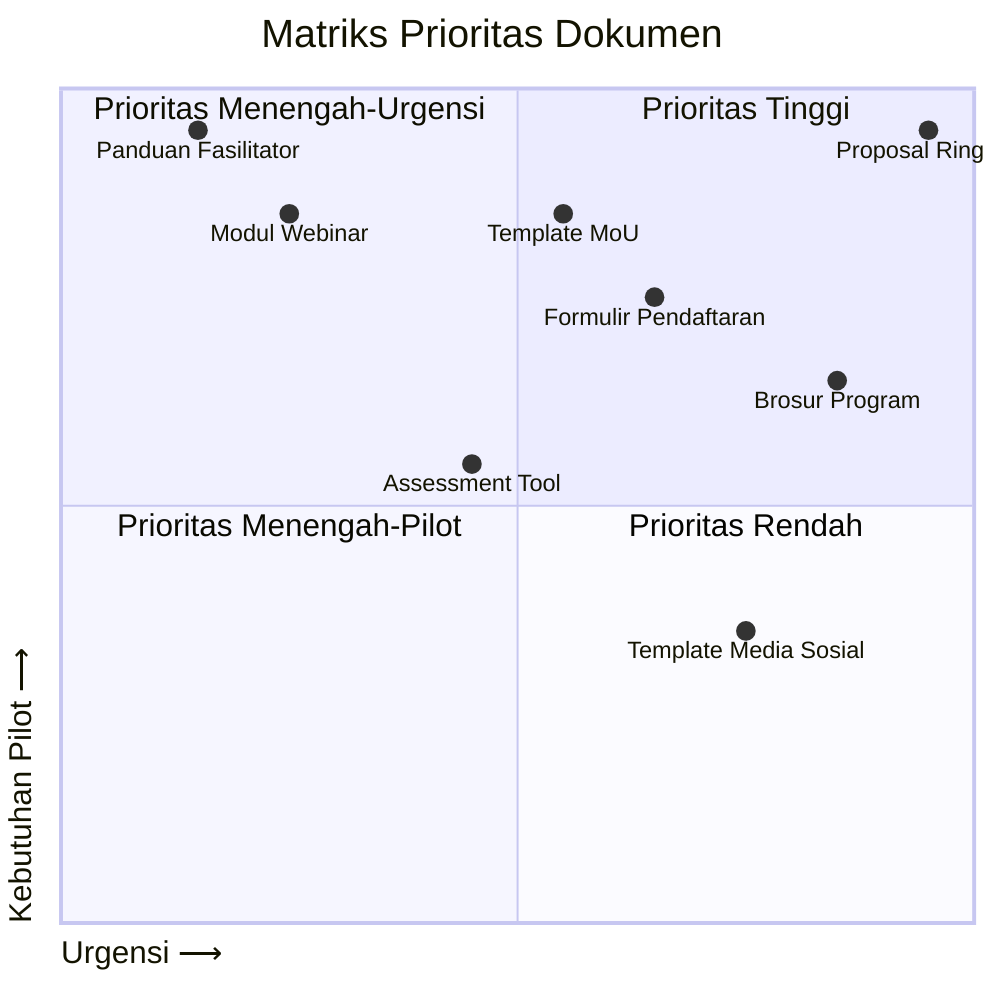

# Matriks Prioritas Dokumen Program

## Kriteria Prioritas

1. **Urgensi Pemasaran** - Tingkat kebutuhan dokumen untuk kampanye pemasaran awal
2. **Kebutuhan Pilot Project** - Pentingnya dokumen untuk pelaksanaan proyek percontohan
3. **Kompleksitas Penyusunan** - Tingkat kesulitan dan sumber daya yang dibutuhkan

## Matriks Dokumen

| Dokumen | Urgensi Pemasaran | Kebutuhan Pilot Project | Kompleksitas | Prioritas |
|---------|-------------------|-------------------------|--------------|-----------|
| Proposal Ringkas | Tinggi | Tinggi | Rendah | 1 |
| Brosur Program | Tinggi | Sedang | Rendah | 2 |
| Template Media Sosial | Tinggi | Rendah | Rendah | 3 |
| Template MoU | Sedang | Tinggi | Tinggi | 4 |
| Formulir Pendaftaran | Sedang | Tinggi | Sedang | 5 |
| Modul Webinar | Rendah | Tinggi | Sedang | 6 |
| Panduan Fasilitator | Rendah | Tinggi | Tinggi | 7 |
| Assessment Tool | Rendah | Sedang | Sedang | 8 |

## Visualisasi Prioritas

**Skala Nilai (0-1):**

- 0.0-0.3 : Rendah
- 0.4-0.6 : Sedang
- 0.7-1.0 : Tinggi

## Catatan

- Prioritas 1-3: Dokumen kritis untuk fase pemasaran awal
- Prioritas 4-6: Dibutuhkan untuk persiapan pelaksanaan program
- Prioritas 7-8: Penyempurnaan selama fase implementasi
