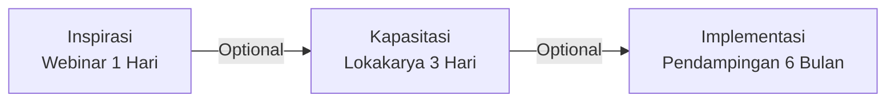

# Presentasi Program: Akselerator Bisnis Komunitas Desa

## Slide 1: Cover

**Akselerator Bisnis Komunitas Desa**  
*Program Pengembangan Ekonomi Berbasis Potensi Lokal*  
Cakra Consulting, 2025  
<www.cakrakonsulting.id/akselerator-desa>

## Slide 2: Latar Belakang

- 74.000+ desa di Indonesia dengan potensi ekonomi belum tergarap optimal
- Tantangan utama:  
  • Keterbatasan pengetahuan & teknologi  
  • Akses pasar dan modal terbatas  
  • Kurangnya pendampingan teknis berkelanjutan
- Kebutuhan pendekatan bertahap:  
  **Inspirasi → Kapasitasi → Implementasi**

## Slide 3: Tujuan Program

1. Memberikan inspirasi melalui kisah sukses pengembangan desa
2. Meningkatkan kapasitas perencanaan usaha berbasis potensi lokal
3. Mendampingi implementasi hingga terwujud usaha operasional
4. Membangun ekosistem kolaborasi antar desa

## Slide 4: Struktur Program (Modular)

## Slide 5: Tahap 1 - Webinar Inspirasi

- **Tema**: "Transformasi Ekonomi Desa: Inspirasi dari 3 Sektor"
- **Pembicara**:  
  • Praktisi sukses desa wisata  
  • Pelaku agribisnis desa  
  • Pengusaha UMKM kreatif desa  
- **Hasil**:  
  • Peningkatan motivasi peserta  
  • Identifikasi awal potensi desa

## Slide 6: Tahap 2 - Lokakarya Kapasitasi

- **Materi Intensif**:  
  • Pemetaan potensi desa  
  • Penyusunan Business Model Canvas  
  • Perencanaan finansial & pemasaran  
- **Hasil**:  
  • Dokumen rencana usaha komprehensif  
  • Proyeksi keuangan 3 tahun

## Slide 7: Tahap 3 - Pendampingan Implementasi

- **Pendampingan 6 Bulan**:  
  • Legalitas & kelembagaan BUMDes  
  • Pengembangan produk/jasa  
  • Strategi pemasaran digital  
  • Akses permodalan  
- **Hasil**:  
  • Usaha desa yang operasional  
  • Sistem pengelolaan berkelanjutan

## Slide 8: Manfaat untuk Desa

- **Jangka Pendek**:  
  • Kelembagaan usaha yang solid  
  • Produk/jasa siap pasarkan
- **Jangka Menengah**:  
  • Kenaikan omset 20%  
  • Perluasan pasar lintas desa
- **Jangka Panjang**:  
  • Kenaikan PADes 15%  
  • Kemandirian ekonomi desa

## Slide 9: Indikator Keberhasilan

| Tahap | Output | Outcome |
|-------|--------|---------|
| **Webinar** | 50+ desa peserta | 30% lanjut lokakarya |
| **Lokakarya** | 90% dokumen lengkap | 50% lanjut pendampingan |
| **Pendampingan** | 100% usaha operasional | Kenaikan pendapatan 20% |

## Slide 10: Struktur Biaya

**Skema Cost-Sharing**:

- **Webinar**: Biaya partisipasi desa [Rp X]
- **Lokakarya**: Rp [Y] per tim desa (5-7 orang)
- **Pendampingan**: Rp [Z] per desa (6 bulan)

**Sumber Pembiayaan**:  
• Dana Desa • APBDes • CSR Perusahaan • Bantuan Pemda

## Slide 11: Cara Bergabung

1. **Pendaftaran Online**:  
   <www.cakrakonsulting.id/akselerator-desa>
2. **Proses Seleksi**:  
   • Webinar → Form minat  
   • Lokakarya → Presentasi rencana  
   • Pendampingan → Verifikasi komitmen
3. **Penandatanganan Kerjasama**

## 📞 Slide 12: Kontak & Informasi

**Cakra Consulting**  
*Lembaga Konsultasi dan Pendampingan Profesional*  
📧 <info@cakrakonsulting.id>  
📱 (021) 1234-5678  
🌐 <www.cakrakonsulting.id>  
📍 Jakarta, Indonesia

## Slide 13: Tanya Jawab

**Pertanyaan?**  
Tim kami siap menjawab kebutuhan spesifik desa Anda
