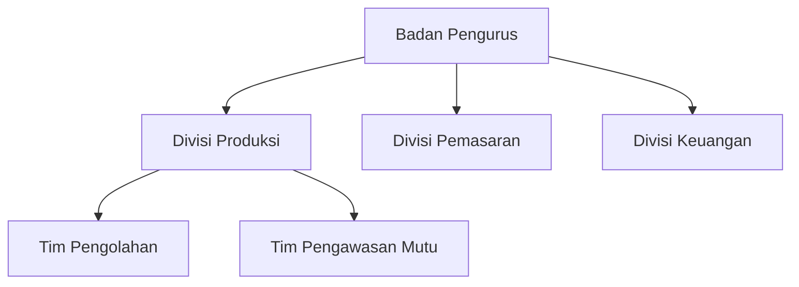

# Template Dokumen Perencanaan

## 1. Template Rencana Bisnis Desa

### Cover

- Logo desa
- Nama usaha desa
- Periode perencanaan
- Tim penyusun

### Ringkasan Eksekutif

- Visi dan misi usaha
- Potensi unggulan
- Target pasar
- Proyeksi keuangan singkat

### Analisis Pasar

- Profil pelanggan
- Analisis kompetitor
- Strategi pemasaran

### Rencana Operasional

- Proses produksi
- Rantai pasok
- Pengelolaan SDM

## 2. Template Proyeksi Keuangan

### Investasi Awal

| Item | Jumlah | Harga Satuan | Total |
|------|--------|--------------|-------|
|      |        |              |       |

### Proyeksi Pendapatan 3 Tahun

| Tahun | Produk/Jasa | Volume | Harga | Total |
|-------|-------------|--------|-------|-------|
| 1     |             |        |       |       |
| 2     |             |        |       |       |
| 3     |             |        |       |       |

### Analisis BEP

- Biaya tetap:
- Biaya variabel per unit:
- Harga jual per unit:
- **BEP (unit):** [rumus perhitungan]

## 3. Template Struktur Organisasi

## 4. Template Rencana Implementasi

| Kegiatan | Bulan 1 | Bulan 2 | Bulan 3 | Penanggung Jawab |
|----------|---------|---------|---------|------------------|
|          |         |         |         |                  |
|          |         |         |         |                  |

## Panduan Pengisian

1. Gunakan bahasa sederhana dan konkret
2. Lampirkan data pendukung jika ada
3. Konsultasikan dengan fasilitator sebelum finalisasi
