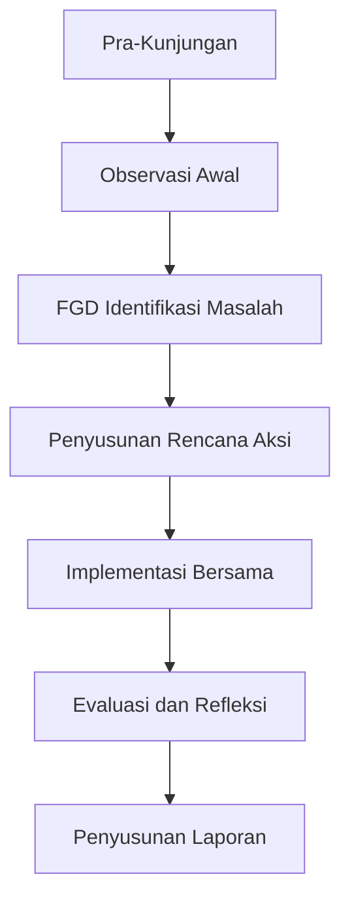

# Protokol Pendampingan Teknis

## Prinsip Dasar Pendampingan

1. **Partisipatif**: Melibatkan masyarakat dalam setiap tahap
2. **Berbasis kebutuhan**: Fokus pada masalah spesifik desa
3. **Berkelanjutan**: Membangun kapasitas lokal
4. **Adaptif**: Menyesuaikan dengan dinamika desa

## Alur Pendampingan

## Protokol Kunjungan

### 1. Sebelum Kunjungan

- Koordinasi dengan perangkat desa 1 minggu sebelumnya
- Siapkan materi pendukung sesuai kebutuhan spesifik
- Konfirmasi jadwal dan peserta

### 2. Saat Kedatangan

- Lapor ke kepala desa dan perangkat
- Presentasikan agenda kunjungan
- Tekankan prinsip gotong royong

### 3. Selama Pendampingan

- Gunakan pendekatan partisipatif (PRA, FGD)
- Dokumentasikan proses dengan foto/catatan
- Fleksibel terhadap perubahan kebutuhan

### 4. Penutupan

- Sampaikan capaian dan rencana tindak lanjut
- Serahkan catatan hasil pertemuan
- Jadwalkan kunjungan berikutnya

## Etika Pendamping

1. **Penampilan**: Rapi dan sopan, gunakan pakaian formal kasual
2. **Komunikasi**: Gunakan bahasa lokal, hindari jargon teknis
3. **Sikap**: Rendah hati, menjadi pendengar aktif
4. **Netral**: Tidak memihak kelompok tertentu

## Manajemen Konflik

1. Identifikasi sumber konflik
2. Fasilitasi dialog antar pihak
3. Fokus pada kepentingan bersama
4. Dokumentasikan kesepakatan

## Keamanan dan Kesehatan

1. Laporkan jadwal perjalanan ke koordinator
2. Hindari wilayah rawan saat malam
3. Bawa P3K pribadi
4. Patuhi protokol kesehatan setempat
