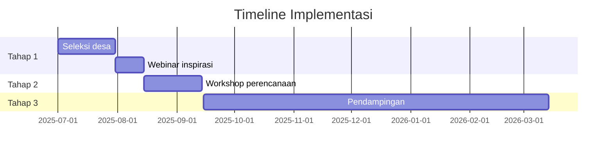

# Proposal Kerjasama untuk Lembaga Donor

## 1. Ringkasan Eksekutif

Program Akselerator Bisnis Komunitas Desa bertujuan memberdayakan 75,000+ desa di Indonesia melalui pendekatan tiga tahap: inspirasi, kapasitasi, dan implementasi.

## 2. Permasalahan yang Diangkat

- 87% desa di Indonesia memiliki potensi ekonomi tak tergarap
- Keterbatasan akses pengetahuan dan pendampingan teknis
- Minimnya jejaring pemasaran produk desa

## 3. Solusi yang Ditawarkan

- Pendekatan modular (webinar, workshop, pendampingan)
- Transfer pengetahuan berbasis kebutuhan spesifik desa
- Pembangunan ekosistem kolaborasi desa-mitra

## 4. Rencana Implementasi

## 5. Anggaran yang Diperlukan

- **Pendanaan Penuh 10 Desa**: Rp [Jumlah]
- **Pendanaan Parsial 20 Desa**: Rp [Jumlah]
- **Program Spesifik Sektor**: Rp [Jumlah]

## 6. Strategi Keberlanjutan

- Skema profit-sharing dari usaha desa
- Pelatihan kader lokal sebagai fasilitator
- Integrasi dengan program pemerintah daerah

## 7. Laporan dan Akuntabilitas

- Laporan triwulanan keuangan dan program
- Audit independen tahunan
- Portal transparansi online
