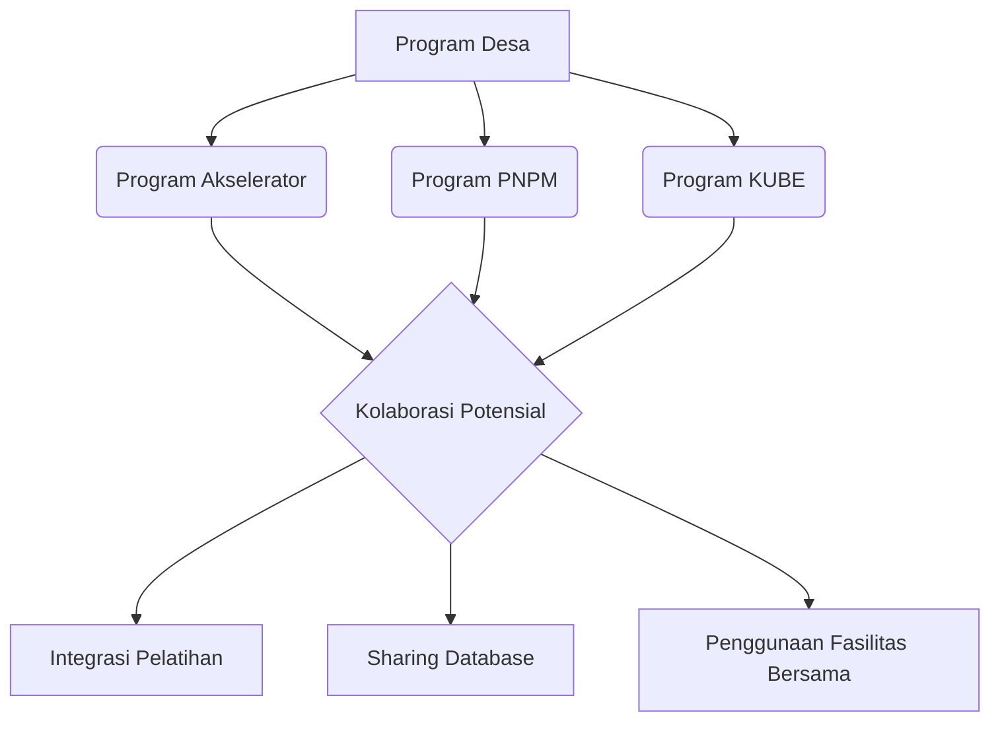

# Panduan Sinergi Program

## 1. Pemetaan Program Sejenis

## 2. Model Kolaborasi

### 2.1. Dengan Program Pemerintah

- **PNPM Mandiri**: Integrasi modul pelatihan
- **KUBE**: Sharing fasilitas pelatihan
- **Dana Desa**: Alokasi anggaran komplementer

### 2.2. Dengan LSM/Lembaga Donor

- Pembagian peran berdasarkan keahlian
- Joint funding program
- Sistem pelaporan terpadu

## 3. Strategi Menghindari Duplikasi

1. **Koordinasi Awal**:
   - Pemetaan program sebelum implementasi
   - Pembentukan forum koordinasi bulanan

2. **Segmentasi Wilayah**:
   - Pembagian wilayah intervensi
   - Penentuan desa sasaran berbeda

3. **Spesialisasi Sektor**:
   - Fokus pada sektor unggulan masing-masing
   - Pembagian peran berdasarkan kompetensi inti

## 4. Mekanisme Resolusi Konflik

1. Identifikasi titik potensi konflik
2. Mediasi oleh tim independen
3. Penyelesaian berbasis bukti
4. Dokumentasi solusi

## 5. Template Perjanjian Kolaborasi

[Lampirkan draft MoU kolaborasi]
