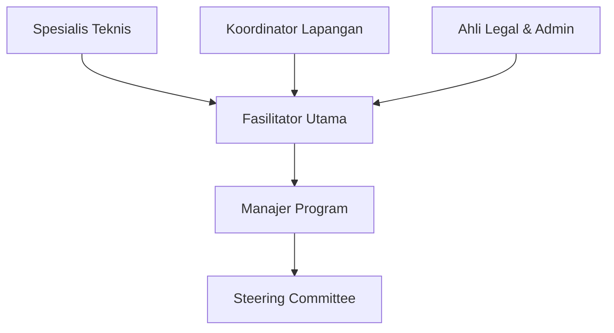

# Pembagian Peran dan Tanggung Jawab Tim Pelaksana

## 1. Manajer Program

### Tanggung Jawab Utama

- Memimpin perencanaan, implementasi, dan evaluasi program
- Mengelola anggaran dan sumber daya
- Koordinasi dengan stakeholder eksternal

### Tugas Spesifik

- Menyusun timeline program
- Memantau pencapaian milestone
- Menjadi penghubung utama dengan pemerintah daerah
- Menyiapkan laporan akhir program

## 2. Fasilitator Utama

### Tanggung Jawab Utama

- Memimpin pelaksanaan workshop
- Fasilitasi proses pembelajaran
- Pendampingan teknis aspek bisnis

### Tugas Spesifik

- Menyiapkan modul pelatihan
- Memandu sesi pemetaan potensi
- Membantu penyusunan business model canvas
- Pendampingan pengembangan rencana pemasaran

## 3. Ahli Legal & Administrasi

### Tanggung Jawab Utama

- Memastikan kepatuhan legal
- Mengelola administrasi program
- Dokumentasi proses dan hasil

### Tugas Spesifik

- Fasilitasi perizinan usaha desa
- Penyusunan MoU dan perjanjian kerjasama
- Pengelolaan database peserta
- Penyusunan laporan berkala

## 4. Spesialis Teknis

### Tanggung Jawab Utama

- Memberikan dukungan teknis spesifik
- Pendampingan implementasi di lapangan
- Transfer pengetahuan teknologi

### Tugas Spesifik

- Analisis kebutuhan teknologi desa
- Pelatihan teknis sesuai sektor unggulan
- Pendampingan pengembangan produk
- Penyusunan SOP operasional

## 5. Koordinator Lapangan

### Tanggung Jawab Utama

- Mengelola logistik kegiatan
- Koordinasi dengan perangkat desa
- Memastikan kelancaran operasional

### Tugas Spesifik

- Pengaturan akomodasi dan transportasi
- Pengelolaan konsumsi peserta
- Penyiapan perlengkapan kegiatan
- Dokumentasi visual kegiatan

## Struktur Pelaporan

## Mekanisme Koordinasi

1. Rapat koordinasi mingguan
2. Laporan harian via grup WhatsApp
3. Update progress melalui shared spreadsheet
4. Evaluasi bulanan dengan seluruh tim

## Mekanisme Eskalasi Masalah

1. Laporkan ke atasan langsung
2. Diskusi solusi dalam rapat koordinasi
3. Konsultasi dengan manajer program jika belum terselesaikan
4. Pembahasan dengan steering committee untuk isu kritis
