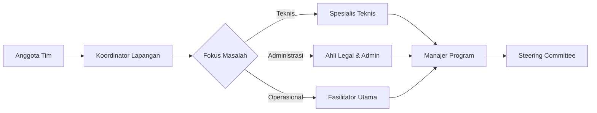

# Protokol Komunikasi Internal Tim

## 1. Saluran Komunikasi

### Komunikasi Rutin

- **WhatsApp Group**: Untuk koordinasi harian dan informasi mendesak
- **Email**: Untuk komunikasi formal dan pengiriman dokumen
- **Google Meet**: Rapat mingguan setiap Senin pukul 10.00 WIB

### Komunikasi Proyek

- **Trello**: Penugasan dan tracking progress
- **Google Drive**: Penyimpanan dokumen bersama
- **Slack**: Diskusi teknis berdasarkan channel

## 2. Jam Operasional Komunikasi

- Hari kerja: 08.00 - 17.00 WIB
- Respons email: Maksimal 4 jam kerja
- Respons WhatsApp: Maksimal 2 jam
- Diluar jam kerja hanya untuk keadaan darurat

## 3. Protokol Pesan

### Struktur Pesan

```
[URGENCY] [SUBJECT] - [BRIEF DESCRIPTION]
Contoh:
[PENTING] Persiapan Webinar - Konfirmasi pembicara
```

### Kode Urgensi

- 🚨 DARURAT: Respon segera (masalah teknis kritis)
- ⚠️ PENTING: Respon dalam 1 jam
- ℹ️ INFORMASI: Respon dalam 4 jam
- 📅 RUTIN: Respon dalam 24 jam

## 4. Protokol Rapat

### Sebelum Rapat

- Agenda dikirim 24 jam sebelumnya
- Dokumen pendukung di-share minimal 2 jam sebelumnya

### Selama Rapat

- Durasi maksimal 90 menit
- Notulen ditunjuk bergantian
- Waktu bicara maksimal 5 menit per topik

### Setelah Rapat

- Notulen disebarkan maksimal 4 jam setelah rapat
- Action item jelas dengan penanggung jawab dan deadline

## 5. Etika Komunikasi

1. Gunakan bahasa formal untuk komunikasi tertulis
2. Hindari singkatan tidak resmi
3. Konfirmasi penerimaan pesan penting
4. Hormati waktu istirahat dan libur
5. Selesaikan konflik secara privat

## 6. Alur Eskalasi Masalah



## 7. Template Komunikasi

### Laporan Harian

```
Tanggal: [date]
Pekerjaan Hari Ini:
1. [Aktivitas 1] - [Status]
2. [Aktivitas 2] - [Status]
Kendala:
- [Deskripsi kendala]
Rencana Besok:
1. [Rencana 1]
2. [Rencana 2]
```

### Permintaan Bantuan

```
Kepada: [Nama]
Dari: [Nama]
Subjek: Permintaan Bantuan [Topik]
Deskripsi:
[Penjelasan detail]
Dibutuhkan Sebelum: [Tanggal/Waktu]
Tingkat Urgensi: [Pilih dari kode urgensi]
