# Protokol Penanganan Krisis Tim Pelaksana

## 1. Kategori Krisis

### 1.1 Teknis

- Gagal sistem webinar
- Kerusakan peralatan workshop
- Gangguan koneksi internet

### 1.2 Operasional

- Pembicara batal mendadak
- Peserta tidak hadir massal
- Masalah akomodasi/logistik

### 1.3 Eksternal

- Perubahan kebijakan pemerintah
- Bencana alam
- Konflik sosial di lokasi

### 1.4 Keamanan

- Pelanggaran data pribadi
- Kehilangan dokumen penting
- Konflik internal tim

## 2. Protokol Respons Cepat

### Langkah Umum

1. Identifikasi jenis dan tingkat keparahan krisis
2. Aktifkan tim respons krisis sesuai kategori
3. Komunikasikan situasi ke stakeholder terkait
4. Terapkan solusi darurat
5. Dokumentasikan seluruh proses

### Timeline Respons

```mermaid
gantt
    title Timeline Respons Krisis
    dateFormat  HH:mm
    section Identifikasi
    Identifikasi masalah      :a1, 00:00, 15m
    section Aktivasi Tim
    Aktivasi tim krisis       :a2, after a1, 15m
    section Komunikasi
    Komunikasi stakeholder    :a3, after a2, 30m
    section Solusi
    Implementasi solusi       :a4, after a3, 1h
    section Dokumentasi
    Pencatatan kejadian      :a5, after a4, 30m
```



## 3. Tim Penanganan Krisis

### Struktur Tim

- **Koordinator**: Manajer Program
- **Anggota**:
  - Ahli Teknis (untuk krisis teknis)
  - Koordinator Lapangan (untuk operasional)
  - Ahli Legal (untuk hukum dan kebijakan)
  - Humas (untuk komunikasi eksternal)

### Tanggung Jawab

- Koordinator: Keputusan akhir dan alokasi sumber daya
- Anggota: Implementasi solusi sesuai bidang
- Seluruh tim: Tersedia 24/7 selama krisis

## 4. Prosedur Khusus

### 4.1 Gagal Teknis Webinar

1. Aktifkan platform cadangan dalam 15 menit
2. Kirim notifikasi ke peserta via SMS/email
3. Perpanjang durasi sesuai waktu gangguan
4. Berikan kompensasi akses rekaman premium

### 4.2 Pembicara Batal

1. Aktifkan pembicara cadangan
2. Jika tidak tersedia, ubah format jadi diskusi panel
3. Berikan kompensasi tambahan ke peserta

### 4.3 Bencana Alam

1. Evakuasi peserta ke lokasi aman
2. Hubungi pihak berwenang setempat
3. Tunda kegiatan sampai kondisi aman
4. Susun ulang jadwal kegiatan

## 5. Komunikasi Krisis

### Prinsip

- Transparan: Berikan informasi faktual
- Proaktif: Update berkala ke stakeholder
- Empati: Tunjukkan kepedulian
- Konsisten: Gunakan satu saluran resmi

### Template Komunikasi

```
Subject: [STATUS] Pembaruan Situasi [Nama Krisis] - [Tanggal]

Salam hormat,

Kami ingin menginformasikan bahwa terjadi [jelaskan krisis singkat] pada [waktu kejadian]. 

Tim kami telah melakukan:
- [Tindakan 1]
- [Tindakan 2]
- [Tindakan 3]

Dampak yang mungkin terjadi:
- [Dampak 1]
- [Dampak 2]

Langkah selanjutnya:
- [Rencana 1]
- [Rencana 2]

Kami memohon maaf atas ketidaknyamanan ini dan akan terus memperbarui informasi terkini.

Hormat kami,
Tim Penanganan Krisis
Cakra Consulting
```

## 6. Evaluasi Pasca Krisis

1. Lakukan assessment menyeluruh 24 jam setelah krisis
2. Identifikasi akar masalah
3. Susun rekomendasi perbaikan sistem
4. Update protokol berdasarkan pembelajaran
5. Lapor ke manajemen puncak
