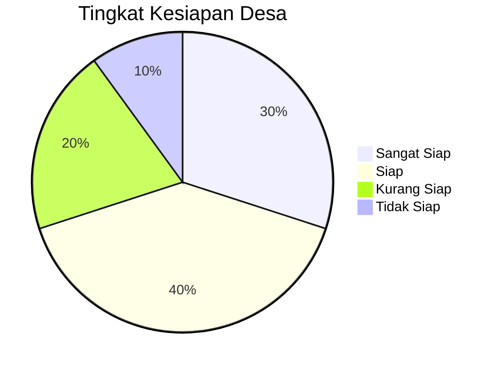

# Form Assessment Potensi Desa

## 1. Identitas Desa

- Nama Desa: ____________________
- Kecamatan: ____________________
- Kabupaten: ____________________
- Provinsi: ____________________
- Nama Tim Assessment: ____________________
- Tanggal Assessment: ____________________

## 2. Data Umum Desa

### 2.1 Demografi

- Jumlah Penduduk: ______
- Jumlah KK: ______
- Luas Wilayah: ______ ha
- Batas Wilayah:
  - Utara: ______
  - Selatan: ______
  - Timur: ______
  - Barat: ______

### 2.2 Aksesibilitas

- Jarak ke Ibu Kota Kecamatan: ______ km
- Kondisi Jalan: [ ] Baik [ ] Sedang [ ] Rusak
- Transportasi Umum: [ ] Ada [ ] Tidak

## 3. Pemetaan Sumber Daya

### 3.1 Sumber Daya Alam

| Jenis Potensi | Ketersediaan | Kualitas | Pemanfaatan Saat Ini |
|---------------|--------------|----------|----------------------|
| Pertanian    |              |          |                      |
| Perikanan     |              |          |                      |
| Peternakan    |              |          |                      |
| Kehutanan     |              |          |                      |
| Pertambangan  |              |          |                      |
| Pariwisata    |              |          |                      |

### 3.2 Sumber Daya Manusia

| Keterampilan | Jumlah | Tingkat Keahlian |
|--------------|--------|------------------|
| Pertanian    |        |                  |
| Kerajinan    |        |                  |
| Teknologi    |        |                  |
| Pemasaran    |        |                  |
| Manajemen    |        |                  |

## 4. Infrastruktur Pendukung

### 4.1 Fasilitas Umum

- Pasar: [ ] Ada [ ] Tidak
- Jalan Usaha Tani: [ ] Ada [ ] Tidak
- Gudang Penyimpanan: [ ] Ada [ ] Tidak
- Sarana Irigasi: [ ] Ada [ ] Tidak

### 4.2 Teknologi

- Jaringan Listrik: [ ] Stabil [ ] Tidak Stabil
- Jaringan Internet: [ ] 4G [ ] 3G [ ] Tidak Ada
- Penggunaan Smartphone: [ ] >50% [ ] <50%

## 5. Potensi Ekonomi Unggulan

### 5.1 Produk Unggulan

1. ____________________ (Jenis: __________)
2. ____________________ (Jenis: __________)
3. ____________________ (Jenis: __________)

### 5.2 Analisis SWOT

| Strength (Kekuatan) | Weakness (Kelemahan) |
|---------------------|----------------------|
| 1.                  | 1.                   |
| 2.                  | 2.                   |

| Opportunity (Peluang) | Threat (Ancaman) |
|-----------------------|------------------|
| 1.                    | 1.               |
| 2.                    | 2.               |

## 6. Kesiapan Kelembagaan

### 6.1 Kelembagaan Desa

- BUMDes: [ ] Ada [ ] Tidak
- Jika ada, tahun berdiri: ______
- Jumlah pengurus: ______

### 6.2 Kelompok Usaha

- Kelompok Tani: ______ kelompok
- Kelompok Nelayan: ______ kelompok
- Koperasi: ______ unit
- UMKM: ______ unit

## 7. Asesmen Kebutuhan Pendampingan

### 7.1 Prioritas Kebutuhan

1. [ ] Pelatihan teknis produksi
2. [ ] Manajemen usaha
3. [ ] Pemasaran digital
4. [ ] Akses permodalan
5. [ ] Teknologi pengolahan

### 7.2 Tingkat Kesiapan

## 8. Rekomendasi Awal

1. ____________________________________________________
2. ____________________________________________________
3. ____________________________________________________

## 9. Tanda Tangan

- Penilai 1: ________________________ (__________________)
- Penilai 2: ________________________ (__________________)
- Ketua Desa: ________________________ (__________________)
