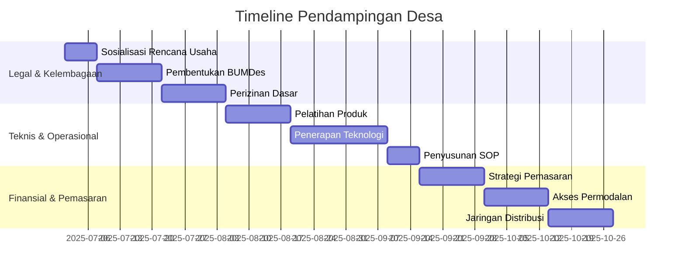
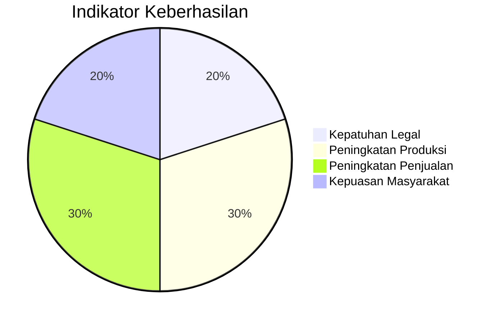

# Template Rencana Pendampingan Desa

## 1. Identitas Desa

- Nama Desa: ____________________
- Kecamatan: ____________________
- Kabupaten: ____________________
- Penanggung Jawab Desa: ____________________
- Kontak: ____________________
- Fasilitator Pendamping: ____________________
- Periode Pendampingan: ____________________

## 2. Analisis Situasi

### 2.1 Potensi Unggulan

- Sektor: ____________________
- Produk/Jasa Utama: ____________________
- Keunikan/Kelebihan: ____________________

### 2.2 Tantangan Utama

1. ____________________
2. ____________________
3. ____________________

## 3. Tujuan Pendampingan

### 3.1 Tujuan Umum

____________________________________________________

### 3.2 Tujuan Spesifik

1. ____________________________________________________
2. ____________________________________________________
3. ____________________________________________________

## 4. Rencana Kegiatan

## 5. Rincian Kegiatan

### 5.1 Bulan 1-2: Legal & Kelembagaan

| Kegiatan | Output | Indikator Keberhasilan | Penanggung Jawab |
|----------|--------|------------------------|------------------|
| Sosialisasi rencana usaha | Dokumen kesepakatan masyarakat | Minimal 80% warga setuju | Fasilitator |
| Pembentukan/penguatan BUMDes | AD/ART BUMDes | Terbentuk struktur organisasi | Ahli Legal |
| Pengurusan perizinan dasar | IUMK/NIB | Dokumen perizinan lengkap | Ahli Legal |

### 5.2 Bulan 3-4: Teknis & Operasional

| Kegiatan | Output | Indikator Keberhasilan | Penanggung Jawab |
|----------|--------|------------------------|------------------|
| Pelatihan pengembangan produk | Produk prototype | Produk memenuhi standar kualitas | Spesialis Teknis |
| Penerapan teknologi tepat guna | Sistem operasional | Peningkatan efisiensi 30% | Spesialis Teknis |
| Penyusunan SOP operasional | Dokumen SOP | SOP diterapkan dalam operasional | Fasilitator |

### 5.3 Bulan 5-6: Finansial & Pemasaran

| Kegiatan | Output | Indikator Keberhasilan | Penanggung Jawab |
|----------|--------|------------------------|------------------|
| Penyusunan strategi pemasaran | Rencana pemasaran | Peningkatan penjualan 20% | Fasilitator |
| Fasilitasi akses permodalan | Dokumen proposal pendanaan | Dana cair sesuai kebutuhan | Ahli Finansial |
| Penguatan jaringan distribusi | Kemitraan dengan distributor | Jangkauan pasar meningkat | Koordinator Lapangan |

## 6. Sumber Daya Yang Dibutuhkan

### 6.1 Sumber Daya Manusia

- Fasilitator: ______ orang
- Spesialis Teknis: ______ orang
- Tenaga Pendukung: ______ orang

### 6.2 Anggaran

| Komponen | Jumlah (Rp) |
|----------|-------------|
| Honor Tim | |
| Operasional | |
| Peralatan | |
| Lain-lain | |
| **Total** | |

### 6.3 Peralatan

1. ____________________
2. ____________________
3. ____________________

## 7. Monitoring & Evaluasi

### 7.1 Indikator Keberhasilan

### 7.2 Metode Evaluasi

- Laporan bulanan
- Kunjungan lapangan
- FGD dengan masyarakat
- Survei kepuasan

## 8. Tanda Tangan

- Fasilitator Pendamping: ________________________
- Perwakilan Desa: ________________________
- Manajer Program: ________________________
- Tanggal: ________________________
