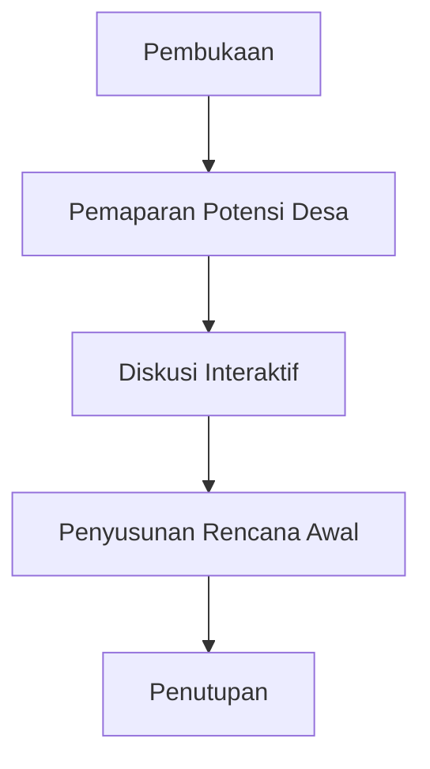

# Checklist Kunjungan Lapangan

## 1. Persiapan Sebelum Kunjungan

### 1.1 Administrasi

- [ ] Surat tugas sudah diterbitkan
- [ ] Surat pemberitahuan ke desa sudah dikirim
- [ ] Surat izin ke instansi terkait (jika perlu)
- [ ] Jadwal kunjungan sudah dikonfirmasi

### 1.2 Perlengkapan

- [ ] Form assessment potensi desa
- [ ] Form rencana pendampingan
- [ ] Kamera dan perlengkapan dokumentasi
- [ ] Perangkat pengisian data digital
- [ ] Peralatan pendukung presentasi
- [ ] Perlengkapan kesehatan dan keselamatan

## 2. Hari-H Kunjungan

### 2.1 Kedatangan

- [ ] Tiba di lokasi sesuai jadwal
- [ ] Koordinasi dengan perangkat desa
- [ ] Penjelasan tujuan kunjungan

### 2.2 Observasi Lapangan

| Area Observasi | Checklist | Temuan |
|----------------|-----------|--------|
| Potensi SDA | [ ] | |
| Infrastruktur | [ ] | |
| Kelembagaan | [ ] | |
| Kegiatan Usaha | [ ] | |
| Pasar dan Distribusi | [ ] | |

### 2.3 Diskusi dengan Masyarakat

- [ ] Pemetaan potensi partisipatif
- [ ] Identifikasi kebutuhan pelatihan
- [ ] Analisis masalah utama
- [ ] Penggalian aspirasi pengembangan

### 2.4 Pertemuan Resmi

## 3. Dokumentasi

### 3.1 Visual

- [ ] Foto lokasi usaha
- [ ] Dokumentasi diskusi masyarakat
- [ ] Rekaman kondisi infrastruktur
- [ ] Foto produk unggulan

### 3.2 Data

- [ ] Form assessment terisi lengkap
- [ ] Notulen diskusi
- [ ] Daftar hadir peserta
- [ ] Peta potensi desa sketsa awal

## 4. Analisis Awal

### 4.1 Temuan Kunci

1. ________________________________________
2. ________________________________________
3. ________________________________________

### 4.2 Rekomendasi Segera

1. ________________________________________
2. ________________________________________
3. ________________________________________

## 5. Pasca Kunjungan

### 5.1 Tindak Lanjut

- [ ] Laporan kunjungan disusun dalam 2 hari
- [ ] Rekomendasi dikirim ke desa
- [ ] Rencana pendampingan awal disiapkan
- [ ] Database desa diperbarui

### 5.2 Evaluasi Kunjungan

| Aspek | Baik | Cukup | Perlu Perbaikan |
|-------|------|-------|-----------------|
| Persiapan | | | |
| Pelaksanaan | | | |
| Dokumentasi | | | |
| Manfaat | | | |

## 6. Tanda Tangan

- Petugas 1: ________________________ (__________________)
- Petugas 2: ________________________ (__________________)
- Perwakilan Desa: ________________________ (__________________)
- Tanggal: ________________________
