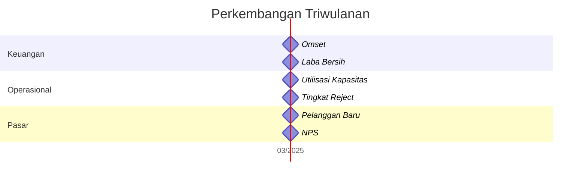

# Indikator Perkembangan Usaha Desa

## 1. Indikator Keuangan

### 1.1 Produksi

- Volume produksi bulanan: ______ unit
- Nilai produksi bulanan: Rp ______
- Biaya produksi per unit: Rp ______

### 1.2 Penjualan

- Omset bulanan: Rp ______
- Volume penjualan bulanan: ______ unit
- Harga jual per unit: Rp ______

### 1.3 Keuntungan

- Laba kotor bulanan: Rp ______
- Laba bersih bulanan: Rp ______
- Margin keuntungan: ______ %

## 2. Indikator Operasional

### 2.1 Kapasitas Produksi

- Kapasitas terpasang: ______ unit/bulan
- Kapasitas terpakai: ______ unit/bulan
- Utilisasi kapasitas: ______ %

### 2.2 Efisiensi

- Bahan baku per unit: ______ kg/unit
- Waktu produksi per unit: ______ jam
- Pengurangan limbah produksi: ______ %

### 2.3 Kualitas

- Tingkat reject produk: ______ %
- Keluhan pelanggan: ______ kasus/bulan
- Peningkatan standar kualitas: [ ] Ya [ ] Tidak

## 3. Indikator Pasar

### 3.1 Ekspansi Pasar

- Jumlah pasar baru: ______
- Jumlah pelanggan baru: ______
- Persentase peningkatan pelanggan: ______ %

### 3.2 Kepuasan Pelanggan

- Tingkat retensi pelanggan: ______ %
- Nilai NPS (Net Promoter Score): ______
- Ulasan positif: ______ %

### 3.3 Pangsa Pasar

- Pangsa pasar lokal: ______ %
- Pangsa pasar regional: ______ %
- Pangsa pasar nasional: ______ %

## 4. Indikator SDM

### 4.1 Kapasitas Tim

- Jumlah SDM terlatih: ______ orang
- Jam pelatihan per orang: ______ jam/bulan
- Sertifikasi kompetensi: ______ orang

### 4.2 Produktivitas

- Output per karyawan: ______ unit/orang
- Nilai tambah per karyawan: Rp ______
- Tingkat absensi: ______ %

### 4.3 Kepuasan Tim

- Tingkat retensi karyawan: ______ %
- Survey kepuasan karyawan: ______ %
- Jumlah inisiatif perbaikan: ______

## 5. Indikator Keberlanjutan

### 5.1 Lingkungan

- Pengurangan emisi: ______ %
- Penggunaan bahan daur ulang: ______ %
- Pengelolaan limbah: [ ] Baik [ ] Cukup [ ] Buruk

### 5.2 Sosial

- Kontribusi ke masyarakat: Rp ______ /bulan
- Jumlah penerima manfaat: ______ orang
- Program pemberdayaan: ______ program

### 5.3 Tata Kelola

- Transparansi laporan keuangan: [ ] Ya [ ] Tidak
- Kepatuhan regulasi: [ ] Ya [ ] Tidak
- Sistem pengawasan internal: [ ] Ada [ ] Tidak

## 6. Dashboard Monitoring



## 7. Metode Pengukuran

1. **Bulanan:**
   - Laporan keuangan
   - Catatan produksi
   - Survey pelanggan sampel

2. **Triwulanan:**
   - Audit internal
   - FGD dengan tim
   - Analisis pasar

3. **Tahunan:**
   - Audit eksternal
   - Evaluasi menyeluruh
   - Perencanaan pengembangan

## 8. Template Laporan Perkembangan

```
Bulan: ____________________
Desa: ____________________
Usaha: ____________________

1. Pencapaian Utama:
   - ________________________________________
   - ________________________________________
   
2. Kendala Utama:
   - ________________________________________
   - ________________________________________
   
3. Target Bulan Depan:
   - ________________________________________
   - ________________________________________
   
4. Tindakan Perbaikan:
   - ________________________________________
   - ________________________________________
   
Penanggung Jawab: ________________________
