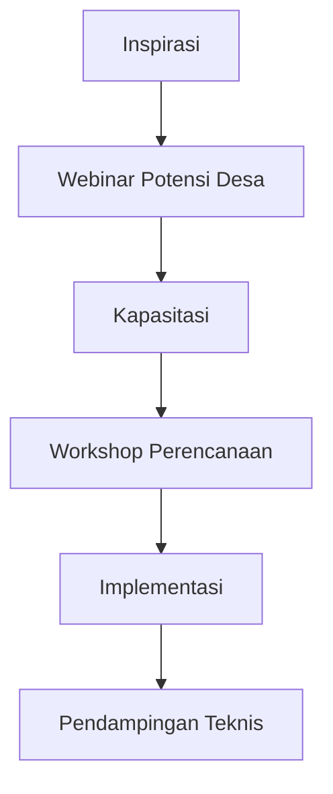

# Modul Pemahaman Program Akselerator Bisnis Komunitas Desa

## 1. Gambaran Umum Program

### 1.1 Tiga Pilar Program

### 1.2 Tujuan Utama

1. Meningkatkan pemahaman dan motivasi pengembangan ekonomi desa
2. Membangun kapasitas perencanaan dan pengelolaan usaha
3. Mendampingi implementasi hingga terwujud manfaat ekonomi
4. Menciptakan ekosistem kolaborasi antar desa

## 2. Tahap Inspirasi: Webinar

### 2.1 Rangkaian Acara

| Sesi | Topik | Durasi |
|------|-------|--------|
| 1 | Pengembangan Desa Wisata | 90 menit |
| 2 | Pengembangan Agribisnis Desa | 90 menit |
| 3 | Pengembangan Industri Kreatif Desa | 90 menit |
| 4 | Panel Diskusi | 90 menit |

### 2.2 Output

- Peningkatan wawasan peserta
- Identifikasi minat dan potensi awal
- Jaringan dengan pembicara dan peserta lain

## 3. Tahap Kapasitasi: Workshop

### 3.1 Kurikulum

**Hari 1: Pemetaan Potensi**

- Teknik identifikasi sumber daya desa
- Analisis SWOT terstruktur
- Prioritisasi pengembangan

**Hari 2: Model Bisnis**

- Business Model Canvas
- Strategi operasional
- Tata kelola usaha desa

**Hari 3: Implementasi**

- Perencanaan keuangan
- Strategi pemasaran
- Penyusunan rencana aksi

### 3.2 Metode Pembelajaran

- Ceramah interaktif
- Diskusi kelompok
- Studi kasus
- Simulasi praktis

## 4. Tahap Implementasi: Pendampingan

### 4.1 Fokus Pendampingan

### 4.2 Mekanisme

- Kunjungan lapangan bulanan
- Konsultasi jarak jauh via WA/email
- Fasilitasi jaringan mitra
- Monitoring perkembangan berkala

## 5. Peran Stakeholder

### 5.1 Tim Pelaksana

- Manajer Program
- Fasilitator Utama
- Ahli Legal & Administrasi
- Spesialis Teknis

### 5.2 Pemerintah Desa

- Menyediakan data dan informasi
- Fasilitasi pertemuan masyarakat
- Alokasikan sumber daya desa

### 5.3 Masyarakat

- Partisipasi aktif
- Implementasi rencana usaha
- Evaluasi berkala

## 6. Strategi Keberlanjutan

### 6.1 Pilar Keberlanjutan

1. **Kelembagaan**: Penguatan BUMDes/Koperasi
2. **Finansial**: Diversifikasi sumber pendanaan
3. **SDM**: Pelatihan berjenjang
4. **Pasar**: Pengembangan jaringan pemasaran

### 6.2 Indikator Keberhasilan

- Peningkatan PAD desa minimal 15%
- Penyerapan tenaga kerja lokal minimal 20%
- Keberlanjutan usaha tanpa pendampingan intensif

## 7. Studi Kasus Sukses

### 7.1 Desa Wisata

- **Lokasi**: Desa XYZ, Jawa Barat
- **Intervensi**: Pelatihan homestay dan pemandu wisata
- **Hasil**: Peningkatan kunjungan 300% dalam 1 tahun

### 7.2 Agribisnis

- **Lokasi**: Desa ABC, Jawa Timur
- **Intervensi**: Teknologi pengolahan pasca panen
- **Hasil**: Nilai jual produk meningkat 150%

### 7.3 Industri Kreatif

- **Lokasi**: Desa DEF, Bali
- **Intervensi**: Branding dan pemasaran digital
- **Hasil**: Ekspor ke 5 negara

## 8. Sumber Daya Pendukung

1. Modul pelatihan lengkap
2. Template dokumen perencanaan
3. Database mitra potensial
4. Video tutorial teknis
5. Forum diskusi online
