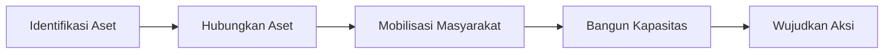
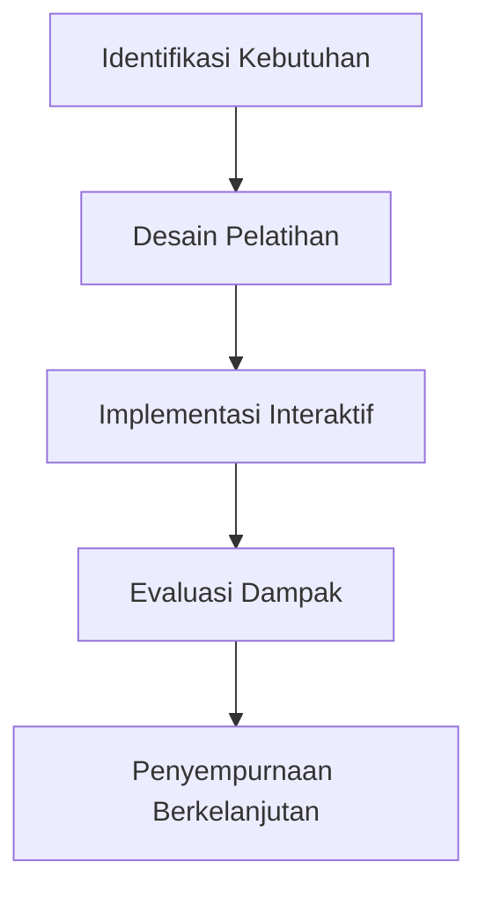

# Teknik Fasilitasi dan Pendampingan Desa

## 1. Prinsip Dasar Pendampingan

### 1.1 Pendekatan ABCD (Asset-Based Community Development)



### 1.2 Nilai Inti

- Partisipatif: Libatkan masyarakat dalam setiap tahap
- Berbasis aset: Fokus pada potensi bukan masalah
- Pemberdayaan: Tingkatkan kapasitas bukan ketergantungan
- Berkelanjutan: Pastikan dampak jangka panjang

## 2. Teknik Fasilitasi Efektif

### 2.1 Metode Interaktif

| Metode | Deskripsi | Penggunaan |
|--------|-----------|------------|
| World Cafe | Diskusi kelompok bergilir | Pemetaan potensi desa |
| Open Space | Agenda ditentukan peserta | Penyelesaian konflik |
| Focus Group Discussion | Diskusi terarah kelompok kecil | Penggalian kebutuhan |
| Role Play | Simulasi situasi nyata | Pelatihan pelayanan |

### 2.2 Alat Bantu Visual

1. **Peta Potensi**: Gambar partisipatif sumber daya desa
2. **Kalender Musim**: Identifikasi pola kegiatan sepanjang tahun
3. **Diagram Venn**: Analisis hubungan antar lembaga
4. **Matriks SWOT**: Evaluasi kekuatan dan kelemahan

## 3. Teknik Pendampingan Berjenjang

### 3.1 Tahap Awal (Bulan 1-2)

- Membangun kepercayaan
- Pemetaan partisipatif
- Penyusunan rencana aksi bersama
- Pembentukan tim penggerak

### 3.2 Tahap Inti (Bulan 3-4)

- Pelatihan teknis spesifik
- Pendampingan implementasi
- Pemecahan masalah kolaboratif
- Penyusunan sistem pengelolaan

### 3.3 Tahap Mandiri (Bulan 5-6)

- Fasilitasi jaringan eksternal
- Evaluasi partisipatif
- Penyusunan rencana keberlanjutan
- Strategi replikasi

## 4. Menghadapi Tantangan

### 4.1 Hambatan Umum

- Resistensi perubahan
- Konflik kepentingan
- Keterbatasan sumber daya
- Komunikasi tidak efektif

### 4.2 Strategi Penanganan

| Hambatan | Strategi | Contoh Teknik |
|----------|----------|---------------|
| Resistensi | Pendekatan bertahap | Coaching individu |
| Konflik | Mediasi partisipatif | Negosiasi win-win |
| Sumber daya terbatas | Optimalisasi aset lokal | Teknologi tepat guna |
| Komunikasi | Pelatihan komunikasi | Active listening |

## 5. Pengembangan Kapasitas

### 5.1 Pelatihan Partisipatif



### 5.2 Mentoring

- Pendampingan one-on-one
- Kunjungan studi banding
- Pendampingan teman sebaya
- Komunitas praktisi

## 6. Monitoring Partisipatif

### 6.1 Alat Monitoring

1. **Papan Progress**: Tampilan visual perkembangan
2. **Buku Catatan Kegiatan**: Dokumentasi harian
3. **Gallery Walk**: Presentasi perkembangan di lokasi
4. **Cerita Perubahan**: Dokumentasi naratif dampak

### 6.2 Indikator Partisipatif

- Jumlah inisiatif masyarakat
- Partisipasi dalam rapat
- Kontribusi sumber daya lokal
- Kepemilikan terhadap program

## 7. Etika Pendamping

### 7.1 Prinsip Etika

1. Hormati nilai lokal dan budaya
2. Jaga kerahasiaan informasi sensitif
3. Hindari konflik kepentingan
4. Transparan dalam pengelolaan sumber daya

### 7.2 Batasan Peran

- Fasilitator bukan pengambil keputusan
- Pendamping bukan pelaksana langsung
- Konsultan bukan pemilik program
- Pendukung bukan penyandang dana

## 8. Template Rencana Pendampingan Individu

```
Nama Pendamping: ____________________
Desa Binaan: ____________________
Periode: ____________________

Tujuan Pendampingan:
1. ________________________________________
2. ________________________________________

Rencana Kegiatan:
| Minggu | Kegiatan | Metode | Indikator Keberhasilan |
|--------|----------|--------|------------------------|
| 1 | | | |
| 2 | | | |
| 3 | | | |

Evaluasi Diri:
- Pencapaian: ________________________________________
- Tantangan: ________________________________________
- Pembelajaran: ________________________________________

Tanda Tangan Pendamping: ________________________
