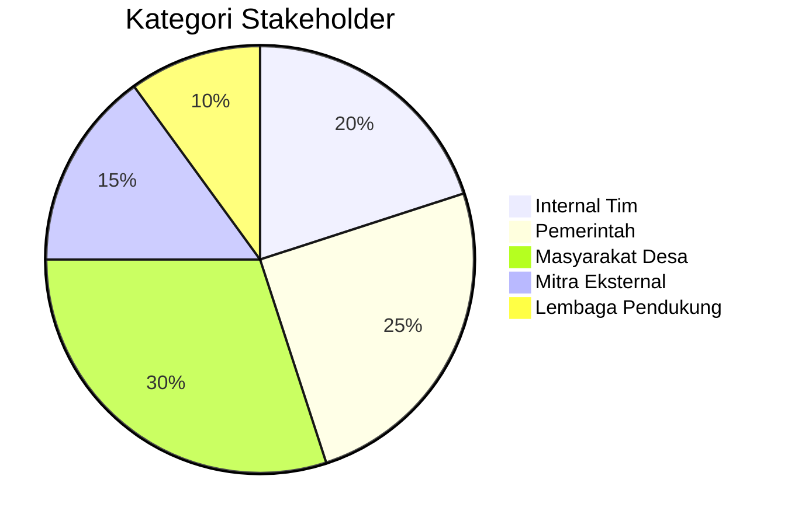
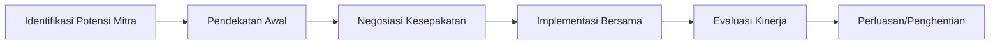

# Pengelolaan Hubungan Stakeholder Program

## 1. Pemetaan Stakeholder

### 1.1 Kategori Stakeholder



### 1.2 Analisis Stakeholder

| Stakeholder | Kepentingan | Pengaruh | Strategi |
|-------------|-------------|----------|----------|
| Pemerintah Desa | Pembangunan ekonomi | Tinggi | Pertemuan rutin, laporan berkala |
| BUMDes/Koperasi | Pengembangan usaha | Tinggi | Pendampingan intensif, akses sumber daya |
| Masyarakat | Peningkatan pendapatan | Sedang | Sosialisasi, pelibatan dalam kegiatan |
| Pemda Kabupaten | Pencapaian target daerah | Tinggi | Koordinasi program, sinergi anggaran |
| Lembaga Donor | Dampak program | Sedang | Laporan kinerja, dokumentasi dampak |

## 2. Strategi Keterlibatan

### 2.1 Tingkat Keterlibatan

1. **Informasi**: Newsletter, update media sosial
2. **Konsultasi**: FGD, survei kebutuhan
3. **Kemitraan**: MoU, program kolaborasi
4. **Pemberdayaan**: Pelibatan dalam keputusan

### 2.2 Rencana Keterlibatan

| Stakeholder | Frekuensi | Metode | Penanggung Jawab |
|-------------|-----------|--------|------------------|
| Pemerintah Desa | Bulanan | Rapat koordinasi | Manajer Program |
| BUMDes | Mingguan | Pendampingan | Fasilitator |
| Masyarakat | Triwulanan | Musyawarah desa | Koordinator Lapangan |
| Pemda | Semesteran | Presentasi capaian | Manajer Program |
| Mitra | Proyek basis | Pertemuan khusus | Ahli Hubungan Eksternal |

## 3. Komunikasi Stakeholder

### 3.1 Saluran Komunikasi

- **Formal**: Surat resmi, laporan tertulis
- **Digital**: Grup WhatsApp, email update
- **Langsung**: Kunjungan, pertemuan tatap muka
- **Media**: Siaran radio desa, papan informasi

### 3.2 Template Komunikasi

#### Update Berkala

```
Subjek: Update Program [Nama Program] - [Bulan]

Kepada Yth. [Nama Stakeholder],

Berikut perkembangan terkini program kami di Desa [Nama Desa]:
- Pencapaian: [Poin 1]
- Tantangan: [Poin 2]
- Rencana: [Poin 3]

Undangan Kegiatan Mendatang:
- [Nama Kegiatan] pada [Tanggal] di [Lokasi]

Terima kasih atas dukungan dan kerjasamanya.

Hormat kami,
Tim Program Cakra Consulting
```

## 4. Manajemen Harapan

### 4.1 Pengaturan Ekspektasi

- Sosialisasi cakupan program sejak awal
- Klarifikasi peran masing-masing stakeholder
- Transparansi keterbatasan program
- Komunikasi realistis tentang target

### 4.2 Penanganan Keluhan

1. Terima keluhan dengan empati
2. Investigasi akar masalah
3. Berikan respons cepat (maks 2x24 jam)
4. Tawarkan solusi konkret
5. Tindak lanjut penyelesaian

## 5. Strategi Kemitraan

### 5.1 Model Kemitraan

- **Sponsorship**: Dukungan dana/barang
- **Knowledge Sharing**: Pertukaran keahlian
- **Co-creation**: Pengembangan program bersama
- **Advokasi**: Dukungan kebijakan

### 5.2 Siklus Kemitraan



## 6. Penguatan Jaringan

### 6.1 Strategi Jaringan

1. Partisipasi dalam forum sektor
2. Pembuatan direktori mitra potensial
3. Penyusunan peta jejaring stakeholder
4. Kegiatan temu jaringan berkala

### 6.2 Pengelolaan Database

| Field | Deskripsi |
|-------|-----------|
| Nama Organisasi | |
| Kontak Utama | |
| Bidang Kerja | |
| Potensi Kolaborasi | |
| Catatan Interaksi | |

## 7. Pengukuran Kepuasan Stakeholder

### 7.1 Metode Pengukuran

- Survey kepuasan tahunan
- Indepth interview stakeholder kunci
- Feedback form setiap kegiatan
- Analisis engagement media sosial

### 7.2 Indikator Kepuasan

1. Tingkat respons komunikasi
2. Keterlibatan dalam kegiatan
3. Dukungan sumber daya
4. Rekomendasi ke pihak lain

## 8. Template Perjanjian Kemitraan

```
PERJANJIAN KERJASAMA
ANTARA
CAKRA CONSULTING
DAN
[NAMA MITRA]

Pasal 1: Lingkup Kerjasama
[Detail lingkup kerjasama]

Pasal 2: Hak dan Kewajiban
- Hak Cakra Consulting: [Hak]
- Kewajiban Cakra Consulting: [Kewajiban]
- Hak Mitra: [Hak]
- Kewajiban Mitra: [Kewajiban]

Pasal 3: Durasi
Mulai: [Tanggal] hingga [Tanggal]

Pasal 4: Penyelesaian Sengketa
[Prosedur penyelesaian sengketa]

Tanda Tangan:

Cakra Consulting: ________________________
Mitra: ________________________
Tanggal: ________________________
