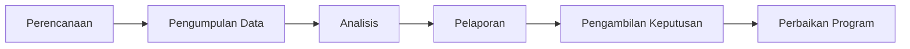
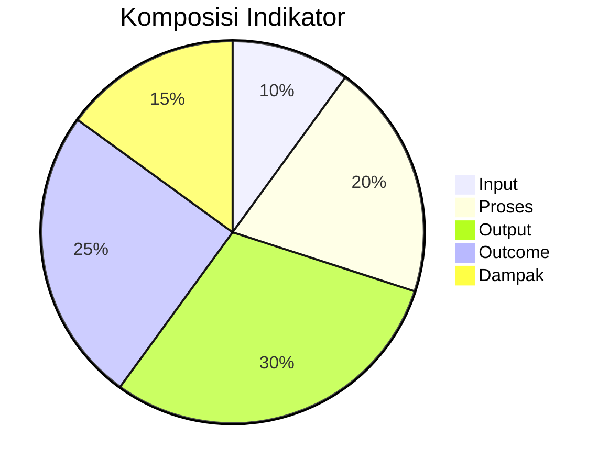
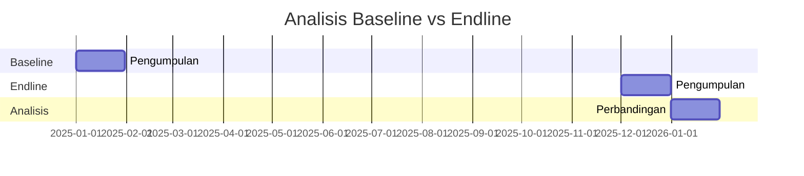

# Monitoring dan Evaluasi Program

## 1. Kerangka MONEV Program

### 1.1 Prinsip Dasar

- Berbasis hasil (result-based)
- Partisipatif
- Berkelanjutan
- Tepat waktu

### 1.2 Siklus MONEV



## 2. Sistem Monitoring

### 2.1 Tingkat Monitoring

| Tingkat | Fokus | Frekuensi |
|---------|-------|-----------|
| Harian | Aktivitas | Laporan harian |
| Mingguan | Progress | Meeting tim |
| Bulanan | Output | Laporan bulanan |
| Triwulanan | Outcome | Review kinerja |

### 2.2 Tools Monitoring

1. **Dashboard Digital**: Visualisasi real-time indikator
2. **Kunjungan Lapangan**: Verifikasi langsung
3. **Logbook Elektronik**: Pencatatan aktivitas harian
4. **Aplikasi Mobile**: Input data langsung di lapangan

## 3. Framework Evaluasi

### 3.1 Pertanyaan Evaluasi

1. **Relevansi**: Apakah program sesuai kebutuhan?
2. **Efektivitas**: Apakah tujuan tercapai?
3. **Efisiensi**: Apakah sumber daya optimal?
4. **Dampak**: Apa perubahan yang terjadi?
5. **Keberlanjutan**: Apakah hasil akan bertahan?

### 3.2 Metode Evaluasi

| Metode | Teknik | Sumber Data |
|--------|--------|-------------|
| Kuantitatif | Survei, Analisis data sekunder | Database program |
| Kualitatif | FGD, Wawancara mendalam | Peserta, Stakeholder |
| Campuran | Studi kasus, Most significant change | Dokumen, Narasi |

## 4. Indikator Kinerja

### 4.1 Jenis Indikator



### 4.2 Contoh Indikator

| Level | Indikator | Target | Satuan |
|-------|-----------|--------|--------|
| Input | Anggaran terserap | 95% | % |
| Proses | Kegiatan terlaksana | 100% | % |
| Output | Dokumen perencanaan | 100% | dokumen |
| Outcome | Usaha operasional | 100% | unit |
| Dampak | Peningkatan PAD | 15% | % |

## 5. Pengumpulan Data

### 5.1 Sumber Data

1. **Primer**:
   - Survei rumah tangga
   - Wawancara mendalam
   - Observasi lapangan

2. **Sekunder**:
   - Laporan keuangan
   - Data statistik desa
   - Dokumen program

### 5.2 Instrumen Pengumpulan

- Kuesioner terstruktur
- Panduan wawancara
- Format observasi
- Panduan FGD

## 6. Analisis Data

### 6.1 Teknik Analisis

| Tipe Data | Teknik Analisis | Alat |
|-----------|----------------|------|
| Kuantitatif | Statistik deskriptif | Excel, SPSS |
| Kualitatif | Analisis tematik | NVivo |
| Campuran | Triangulasi | Matriks analitik |

### 6.2 Analisis Perbandingan



## 7. Pelaporan

### 7.1 Jenis Laporan

1. **Laporan Kemajuan**: Bulanan, fokus aktivitas
2. **Laporan Triwulanan**: Capaian output
3. **Laporan Akhir**: Evaluasi menyeluruh
4. **Laporan Dampak**: Analisis outcome 1 tahun pasca

### 7.2 Template Laporan

```
JUDUL LAPORAN: [Jenis Laporan] [Nama Program] [Periode]

1. Ringkasan Eksekutif
2. Pendahuluan
3. Metodologi
4. Temuan Utama
   - Pencapaian
   - Tantangan
   - Pembelajaran
5. Analisis
6. Rekomendasi
7. Lampiran
```

## 8. Penggunaan Hasil MONEV

### 8.1 Pengambilan Keputusan

1. Perbaikan implementasi program
2. Alokasi sumber daya
3. Penyesuaian strategi
4. Perencanaan program berikutnya

### 8.2 Diseminasi

- Presentasi ke stakeholder
- Policy brief
- Artikel pembelajaran
- Video dokumenter
