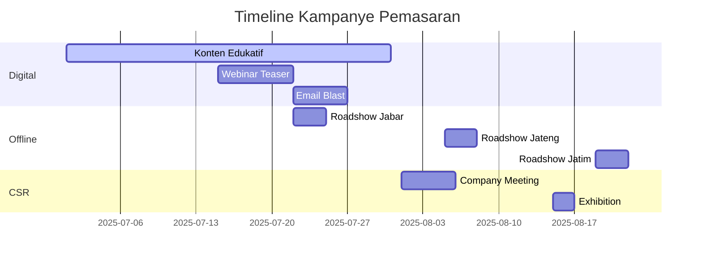

# Strategi Pemasaran Program Akselerator Bisnis Komunitas Desa

## 1. Segmentasi Target Desa

- **Prioritas Wilayah**: Jawa, Bali, Sumatera
- **Kategori Potensi Ekonomi**:
  - Desa Wisata (40%)
  - Agribisnis/Peternakan (35%)
  - Industri Kreatif/UMKM (25%)
- **Kriteria Kesiapan Kelembagaan**:
  - Memiliki BUMDes aktif
  - Alokasi dana desa untuk pengembangan ekonomi
  - Tim pengelola minimal 5 orang

## 2. Strategi Komunikasi

- **Digital**:
  - Seri konten "7 Potensi Desa Terpendam" di Instagram/FB
  - Webinar teaser gratis: "Sukseskan Dana Desa dengan 3 Langkah"
  - Email blast ke database 500+ pemerintah desa
- **Offline**:
  - Roadshow 5 kabupaten prioritas (Jawa Barat, Jawa Tengah, Jawa Timur, Bali, Sumatera Barat)
  - Kolaborasi dengan Dinas PMD setempat
- **Hybrid**:
  - CSR matching event dengan 10 perusahaan
  - Pameran produk desa di kantor pusat perusahaan

## 3. Timeline Kampanye

## 4. Indikator Keberhasilan

| Metrik | Target |
|--------|--------|
| Desa mendaftar webinar | 100+ |
| MoU dengan pemkab | 5 |
| Engagement rate media sosial | 15% |
| Perusahaan mitra CSR | 3 |
| Leads untuk workshop | 30 desa |
