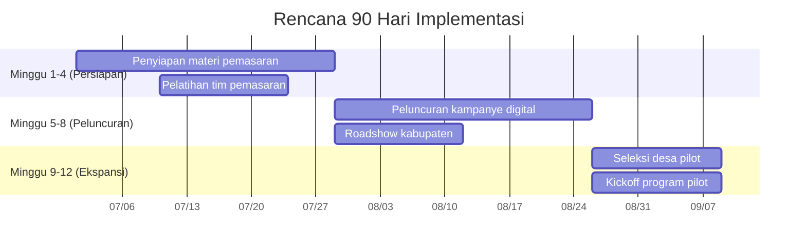

# Rencana Aksi 90 Hari Pertama

## 1. Timeline Kegiatan

## 2. Pembagian Tanggung Jawab

| Aktivitas | Penanggung Jawab | Support Team | Deadline |
|-----------|------------------|--------------|----------|
| Pengembangan konten digital | Ahli Komunikasi | Admin, Desainer | 2025-07-15 |
| Pelaksanaan webinar teaser | Manajer Program | Tim Teknis | 2025-07-20 |
| Koordinasi roadshow | Manajer Program | Logistik | 2025-07-25 |
| Seleksi desa pilot | Ahli Pengembangan Usaha | Tim Lapangan | 2025-08-15 |

## 3. Alokasi Sumber Daya

- **Anggaran**: Rp 120 juta (dari RAB fase persiapan)
- **Tim**:
  - 1 Manajer Program (FT)
  - 1 Ahli Komunikasi (FT)
  - 1 Admin (FT)
  - 2 Konsultan Spesialis (PT)
- **Teknologi**:
  - Platform webinar premium
  - Tools analisis media sosial
  - Aplikasi manajemen proyek
- **Quick Wins**:
  - 5 konten viral (min. 10k reach)
  - 3 desa pilot terpilih
  - 1 kemitraan CSR awal
