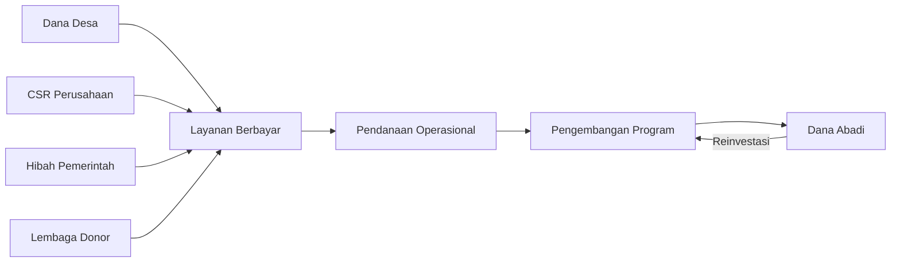

# Strategi Keberlanjutan Program

## 1. Model Bisnis Berkelanjutan

## 2. Roadmap Pengembangan 3 Tahun

| Tahun | Fokus | Target Capaian |
|-------|-------|----------------|
| 2026 | **Ekspansi Wilayah** | 10 provinsi, 100 desa terlibat |
| 2027 | **Digitalisasi Layanan** | Platform pendampingan online, 70% konten digital |
| 2028 | **Kemitraan Global** | 2 mitra internasional, program pertukaran |

## 3. Indikator Keberlanjutan

- **Keuangan**:
  - Rasio pendanaan mandiri vs eksternal: 60:40
  - Pertumbuhan pendapatan tahunan: 25%
- **Operasional**:
  - Tingkat retensi desa: >80%
  - Jumlah program turunan: 3+ produk layanan
- **Dampak**:
  - Peningkatan PAD desa rata-rata: 15% tahunan
  - Penciptaan lapangan kerja: 10-15/desa

## 4. Strategi Scaling

- **Replikasi Model**: Adaptasi program untuk berbagai tipe desa
- **Franchise Sosial**: Kerjasama dengan lembaga lokal untuk implementasi
- **Premium Services**: Layanan konsultasi berbayar untuk desa maju
