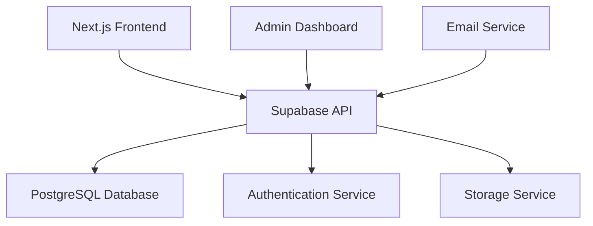

# Sistem Pendaftaran Online Terintegrasi

Lihat mockup UI: **[Form Registrasi](89-form-registrasi.html)**

## Arsitektur Sistem



## Komponen Utama

1. **Frontend**:
   - Next.js 14 (App Router)
   - TypeScript
   - Shadcn UI components
   - React Hook Form + Zod validation

2. **Backend**:
   - Supabase (Backend-as-a-Service)
   - PostgreSQL database
   - Row-Level Security (RLS)
   - Authentication (Email/Password + OAuth)

3. **Integrasi**:
   - Nodemailer untuk notifikasi email
   - Cloudinary untuk penyimpanan dokumen

## Fitur Utama

1. **Pendaftaran Multi-Tahap**:
   - Webinar (form sederhana)
   - Workshop (form lengkap + dokumen pendukung)
   - Pendampingan (form komprehensif + assessment)

2. **Pembayaran Manual**:

   ```mermaid
   flowchart TD
       A[Input Nomor Referensi] --> B[Upload Bukti Transfer]
       B --> C[Verifikasi Admin]
       C --> D[Konfirmasi Status]
   ```

3. **Manajemen Pengguna**:
   - Peserta (melihat/mengedit profil)
   - Admin (kelola pendaftaran, verifikasi pembayaran)
   - Super Admin (manajemen sistem)

## Keamanan

1. Enkripsi data di transit (SSL/TLS)
2. Enkripsi data di rest (AES-256)
3. Autentikasi dua faktor opsional
4. Audit log untuk aktivitas admin
