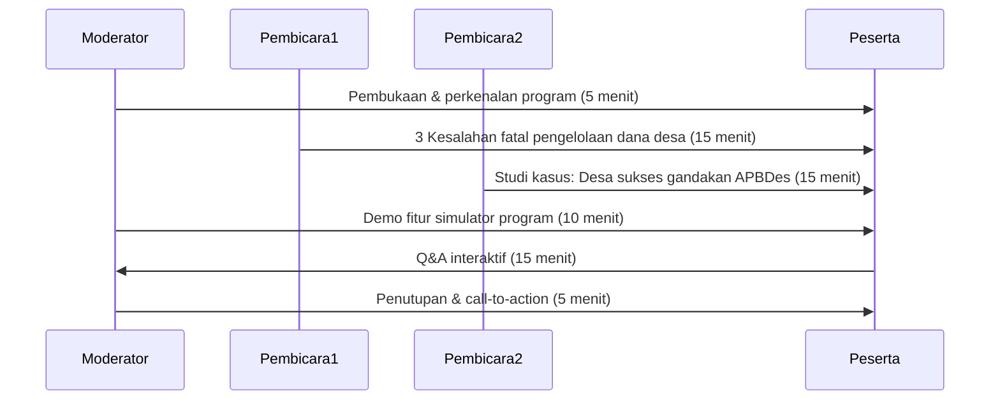

# Webinar Teaser: "Sukseskan Dana Desa dengan 3 Langkah"

## Rencana Implementasi

- **Judul:** Sukseskan Dana Desa dengan 3 Langkah
- **Durasi:** 60 menit
- **Format:** Online via Zoom + Live streaming YouTube
- **Tanggal:** 2 minggu sebelum webinar utama
- **Pembicara:**
  - Pakar pengelolaan dana desa
  - Perwakilan desa sukses
  - Tim Cakra Consulting

## Alur Pendaftaran

1. Landing page dengan formulir pendaftaran sederhana
2. Autoresponder email konfirmasi
3. Email reminder 24 jam sebelum acara
4. Email follow-up dengan rekaman

## Konten Webinar

## Strategi Promosi

1. **Pra-acara:**
   - Countdown 3 hari di media sosial
   - Email blast ke database 500+ desa
   - Kerjasama dengan asosiasi pemerintah desa

2. **Saat acara:**
   - Live comment engagement
   - Polling interaktif
   - Giveaway voucher pendaftaran workshop

3. **Pasca-acara:**
   - Edaran rekaman ke yang tidak hadir
   - Analisis lead untuk follow-up
   - Konversi ke pendaftaran webinar utama

## Target Kinerja

- Jumlah pendaftar: 300+ peserta
- Tingkat kehadiran: 60%+
- Konversi ke webinar utama: 30%
- Lead qualifikasi tinggi: 100+ desa
