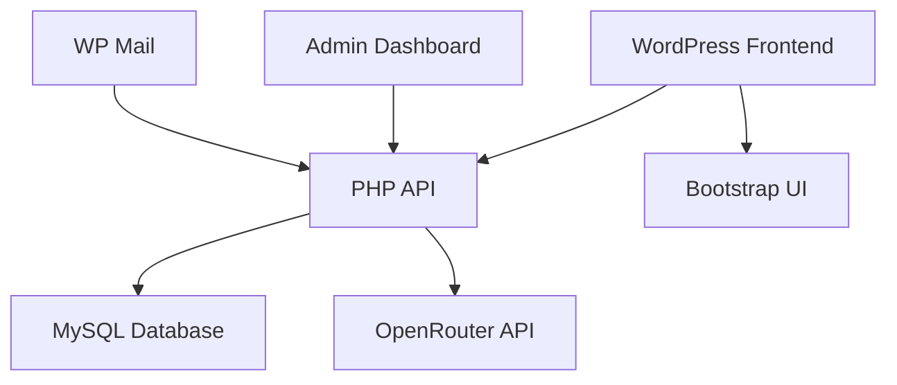

# Platform Khusus: Aplikasi Web Interaktif WordPress

Lihat mockup UI: **[Mockup Platform Khusus](94-mockup-platform-khusus.html)**

## Arsitektur Sistem



## Komponen Utama

1. **Frontend**:
   - WordPress 6.0+
   - Custom PHP plugin
   - Bootstrap 5.3
   - jQuery + AJAX
   - Chart.js untuk visualisasi

2. **Backend**:
   - PHP 8.1+
   - MySQL/MariaDB
   - WordPress REST API
   - Custom database tables

3. **Integrasi**:
   - OpenRouter API untuk AI chatbot
   - WP Mail untuk notifikasi
   - File storage lokal

## Fitur Utama

1. **Self-assessment Potensi Desa**:
   - **Input**:
     - Pemilihan sektor (pertanian, pariwisata, industri kreatif)
     - Jawaban kuesioner 50+ pertanyaan (skala 1-5)
     - Data pendukung (luas lahan, jumlah penduduk, dll)
   - **Proses**:
     - Hitung skor per sektor: `skor = (total_jawaban / jumlah_pertanyaan) * 20`
     - Tentukan tingkat potensi:
         - 0-40: Rendah
         - 41-70: Sedang
         - 71-100: Tinggi
     - Generate rekomendasi berbasis template sesuai sektor
   - **Output**:
     - Skor per sektor (0-100)
     - Tingkat potensi (Rendah/Sedang/Tinggi)
     - Daftar rekomendasi pengembangan
     - Laporan PDF

   ```mermaid
   flowchart TD
    A[Start] --> B[Pilih Sektor]
    B --> C[Isi Pertanyaan]
    C --> D[Simpan Respons]
    D --> E[Generate Skor]
    E --> F[Generate Rekomendasi]
    F --> G[Tampilkan Hasil]
    G --> H[Ekspor PDF]
   ```

2. **Simulator Manfaat Program**:
   - **Input**:
     - Jenis usaha (agribisnis, desa wisata, UMKM kreatif)
     - Investasi awal (Rp)
     - Jumlah SDM
     - Perkiraan pertumbuhan/tahun (%)
     - Biaya operasional/tahun
   - **Proses**:
     - Proyeksi pendapatan:
         `pendapatan_tahun_n = investasi_awal * (1 + pertumbuhan)^n`
     - Proyeksi tenaga kerja:
         `tenaga_kerja_tahun_n = jumlah_sdm * (1 + 0.1 * n)`
     - Hitung titik impas:
         `tahun_impas = log(investasi_awal / pendapatan_tahun_1) / log(1 + pertumbuhan)`
   - **Output**:
     - Proyeksi pendapatan 5 tahun
     - Proyeksi penyerapan tenaga kerja
     - Titik impas (dalam tahun)
     - Grafik interaktif Chart.js

3. **Sistem Konsultasi**:
   - **Input**:
     - Pertanyaan user (text)
     - Konteks sesi chat
     - Preferensi bahasa (Indonesia)
   - **Proses**:
     1. Cek ketersediaan konsultan
     2. Jika tersedia: route ke konsultan manusia
     3. Jika tidak: kirim ke OpenRouter API

        ```php
        $response = openrouter_chat([
          'model' => 'openrouter/gpt-3.5-turbo',
          'messages' => [
            ['role' => 'system', 'content' => 'Anda konsultan pengembangan desa'],
            ['role' => 'user', 'content' => $question]
          ]
        ]);
        ```

   - **Output**:
     - Balasan real-time (AI/human)
     - Riwayat percakapan
     - Rekomendasi tindak lanjut

## Keamanan

1. Nonce protection untuk AJAX
2. Sanitasi input data
3. Role-based access control
4. Enkripsi koneksi (SSL)
