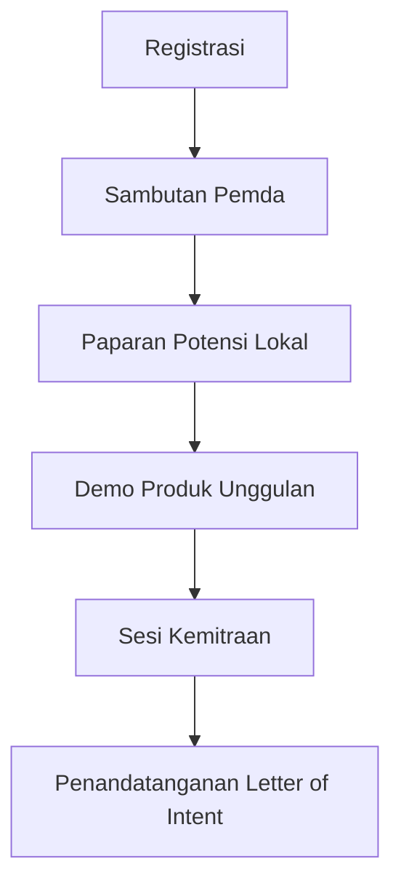

# Panduan Penyelenggaraan Roadshow Kabupaten

## 1. Pendahuluan

Roadshow kabupaten bertujuan memperkenalkan program Akselerator Bisnis Komunitas Desa kepada pemerintah daerah dengan fokus pada wilayah yang memiliki potensi ekonomi belum tergarap optimal. Manfaat utama:

- Mengidentifikasi desa dengan potensi tinggi yang belum berkembang
- Membangun kemitraan strategis dengan pemda
- Meningkatkan partisipasi desa terpencil dalam program

## 2. Kriteria Pemilihan Lokasi

### Parameter Utama

- **Potensi Tidak Tergarap** (Prioritas Utama):
  - SDA melimpah tapi minim industri pengolahan
  - Produk lokal unik tanpa akses pasar
  - SDM terampil tapi kurang wirausaha
  
- **Komitmen Pemda**:
  - Anggaran pengembangan desa tersedia
  - Regulasi mendukung BUMDes/UMKM
  - Tim khusus pengembangan ekonomi desa

- **Diversifikasi Sektor**:
  - Mewakili 3 sektor unggulan: wisata, agribisnis & UMKM
  - Keseimbangan wilayah: pesisir, pegunungan, perkotaan

### Contoh Lokasi Potensial

1. **Kabupaten Belu (NTT)**:
   - Potensi: Tenun ikat premium, belum ada industri pengolahan
   - Status: Anggaran desa tersedia tapi minim program pengembangan

2. **Kabupaten Halmahera Utara (Malut)**:
   - Potensi: Cengkeh dan pala organik, belum ada pemasaran ekspor
   - Status: Regulasi mendukung tapi SDM terbatas

3. **Kabupaten Kaimana (Papua Barat)**:
   - Potensi: Ekowisata bahari, belum terkelola profesional
   - Status: Infrastruktur dasar tersedia tapi minim investor

## 3. Mekanisme Kolaborasi Dinas PMD

### Tahapan Koordinasi

1. **Pemetaan Potensi** (H-45):
   - Analisis data [Database Desa Potensial](82-database-desa-potensial.md)
   - Identifikasi kesenjangan pengembangan

2. **Pendekatan Awal** (H-30):
   - Kirim [Surat Penawaran Custom](34-surat-penawaran-pemerintah-kabupaten.md) yang menyoroti potensi lokal

3. **Penyelarasan Program** (H-20):
   - Gunakan [Policy Brief](65-policy-brief-pemerintah.md) untuk menunjukkan peluang pengembangan
   - Susun MoU kolaborasi ([Template Adaptif](22-mou-pemerintah-kabupaten.md))

## 4. Paket Acara (Contoh)

## 5. Indikator Keberhasilan

- Jumlah MoU ditandatangani
- Desa berminat ikut program
- Komitmen anggaran pemda
- Kemitraan usaha terjalin

> Catatan: Fokus pada kualitas bukan kuantitas - 1 kabupaten sukses lebih baik dari 5 kabupaten tanpa tindak lanjut
