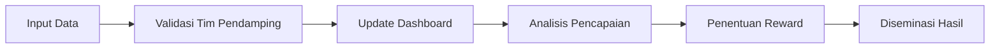

# Panduan Sistem Monitoring Program Pendampingan Desa

## 1. Pendahuluan

Panduan ini mengatur sistem monitoring untuk Program Akselerator Bisnis Komunitas Desa pada tahap implementasi pilot project. Sistem ini dirancang untuk memantau perkembangan secara real-time, mengukur pencapaian, dan memberikan apresiasi atas kemajuan yang dicapai.

## 2. Komponen Sistem Monitoring

### 2.1. Dashboard Real-Time

Platform digital yang menampilkan perkembangan terkini semua desa peserta secara visual.

**Fitur:**

- Tampilan agregat seluruh desa
- Drill-down ke tingkat desa individu
- Grafik tren perkembangan bulanan
- Tanda warna (hijau/kuning/merah) untuk status capaian

### 2.2. Key Performance Indicators (KPI) Unik

Setiap desa memiliki KPI khusus yang disesuaikan dengan jenis usaha dan target spesifik.

**Contoh KPI:**

| Jenis Usaha | KPI Unik |
|-------------|----------|
| **Desa Wisata** | - Jumlah kunjungan wisatawan - Okupansi homestay - Rating kepuasan pengunjung |
| **Agribisnis** | - Produktivitas lahan (ton/ha) - Jaringan distribusi terbentuk - Volume penjualan bulanan |
| **UMKM Kreatif** | - Jumlah produk baru dikembangkan - Ekspor pertama tercapai - Peningkatan omset bulanan |

### 2.3. Sistem Reward

Mekanisme penghargaan berbasis pencapaian milestone.

**Tingkat Reward:**

1. **Bronze** : Capai 50% milestone bulanan
2. **Silver** : Capai 75% milestone bulanan
3. **Gold** : Capai 100% milestone bulanan + inovasi tambahan

## 3. Mekanisme Pengumpulan Data

### 3.1. Sumber Data

- Input manual oleh tim desa via aplikasi
- Integrasi dengan sistem POS/usaha desa
- Laporan kunjungan pendamping
- Survey lapangan berkala

### 3.2. Frekuensi Update

| Data | Frekuensi |
|------|-----------|
| Operasional harian | Real-time |
| Keuangan | Mingguan |
| Pencapaian milestone | Bulanan |

## 4. Proses Monitoring

### 4.1. Alur Kerja

### 4.2. Evaluasi Berkala

- **Mingguan**: Review cepat via daring
- **Bulanan**: Rapat evaluasi dengan stakeholder
- **Triwulanan**: Audit menyeluruh

## 5. Sistem Reward dan Insentif

### 5.1. Jenis Reward

- **Finansial**: Bonus pencapaian (XX% dari target)
- **Non-Finansial**:
  - Sertifikat penghargaan
  - Feature di media sosial
  - Kesempatan jadi narasumber webinar
  - Prioritas akses pendanaan

### 5.2. Kriteria Penghargaan

| Level | Kriteria | Hadiah |
|-------|----------|--------|
| **Gold** | Capai 100% KPI + inovasi | Bonus X.XXX + Sertifikat Emas |
| **Silver** | Capai 75-99% KPI | Bonus X.XXX + Sertifikat Perak |
| **Bronze** | Capai 50-74% KPI | Sertifikat Perunggu |

## 6. Tanggung Jawab

### 6.1. Tim Desa

- Menginput data real-time
- Verifikasi keakuratan data
- Melaporkan kendala operasional

### 6.2. Pendamping

- Validasi data lapangan
- Analisis gap pencapaian
- Fasilitasi pemecahan masalah

### 6.3. Manajemen Program

- Pemantauan agregat
- Alokasi reward
- Pengembangan sistem

## 7. Teknologi Pendukung - [CakraDesa](dokumen/100-sistem-monitoring-desa.html)

- **Aplikasi Web Progressive (PWA) Offline-First**:
  - Akses via browser di `monitor.cakradesa.id`
  - Dapat diinstall di homescreen mobile/desktop
  - Mode offline penuh dengan penyimpanan data lokal
  - Sinkronisasi data saat koneksi tersedia

- **Sistem Upload/Download Data**:
  - Download formulir data saat online
  - Isi data offline
  - Upload hasil saat koneksi tersedia

- **Notifikasi Terjadwal**: Via SMS/WhatsApp saat koneksi tersedia
